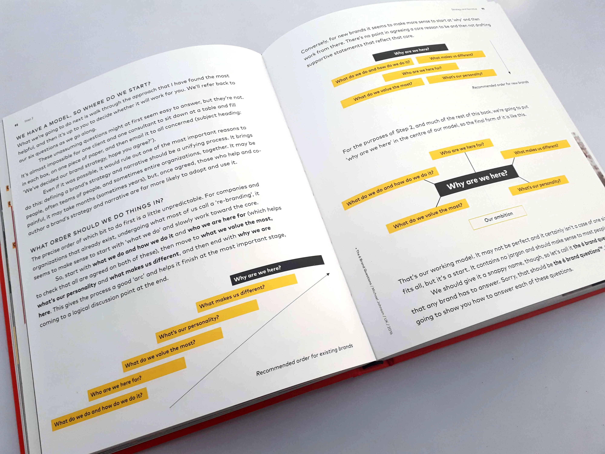
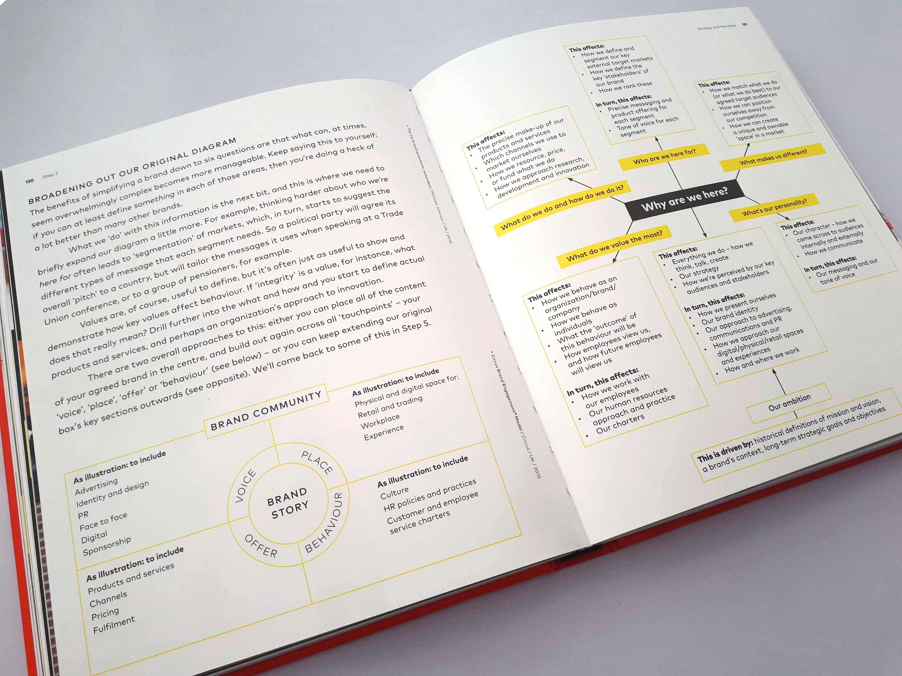
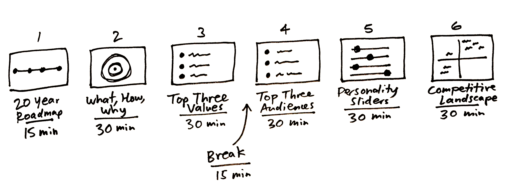
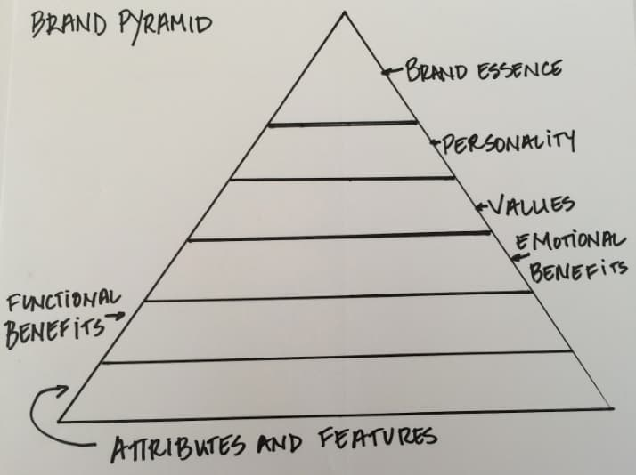

# Branding

Branding is the art of expressing the essence of something. The form of that expression can range across all modes of communication: verbal, visual, behavioural. Its in the layout of space, the logo, the typography, the way you interact.

This is our howto guide to branding. We have no expertise in this area so our approach is entirely based on the work of others, in particular the brilliant Michael Johnson of [Johnson Banks][] and his excellent book ["Branding: In Five and a Half Steps"][5half]:

[Johnson Banks]: https://www.johnsonbanks.co.uk/
[5half]: https://www.johnsonbanks.co.uk/thoughts/branding-in-five-and-a-half-steps

1. Investigate
2. Strategy and Narrative
3. (2.5) Bridging the Gap
4. Design
5. Implement
6. Engage and Revive

We're only really going to cover steps one and two as the rest are more in the doing -- there's not much to say.

## Investigate

Various structures you can use:

* SWOT (I've personally never liked this much)
* Facts, Obstacles and Opportunities

#### What: Questions about the functional, the nuts and bolts stuff

* What do you do?
* How do you do it?
* What's different

#### Personality and Values: Questions about the emotional aspects

* What does this company / organization / brand believe in?
* What do it value the most?
* What personality does it have?

#### Purpose: Questions about "why we're here"

* What you been put on earth to do?
* What problem do you want to solve?
* What's our long-term ambition (and why will it matter in the future)?
* What does success look like?


#### For NGOs

```
                       |
  What's the problem   |    Why does that
  we're here to fix?   |    matter now?
                       |
----------------------------------------------
                       |
  What are we          |    What do we want
  doing about it?      |    others to do?
                       |
```

## Strategy and Narrative

6 step process

* What do we do and how do we do it?
* Who are we here for?
* What do we value the most?
* What’s our personality?
* What makes us different?
* Why are we here? [Our ambition]

This order can vary depending on whether for existing brands or new ones:



You can drill down a lot more into each of these:



### Working out the Why with Scenarios

Esp like p.94 where he suggests generating various "why" options as a way to stimulate discussion and move things forward. For example, for Virgin (note none of these were ultimately selected):

|      **Unforgettable travel**     |           **Love to fly**           | **Spirit of adventure**                    |
|:---------------------------------:|:-----------------------------------:|--------------------------------------------|
| Humanizing the business of travel | Celebrate the magic of human flight | Get more out of life and life's adventures |


### Manifestos

Just watch Jobs from 1997 (an incredible piece on branding):

<iframe width="560" height="315" src="https://www.youtube.com/embed/Oz1_tOXfSeM" frameborder="0" allow="accelerometer; autoplay; encrypted-media; gyroscope; picture-in-picture" allowfullscreen></iframe>

## Bridging the Gap

This is where naming happens.

## Design

Create a design brief and hand it over to the creatives and see how it goes.


## Appendix: Google Ventures 3h Brand Sprint

This is not a full branding process. Rather it is a quick and dirty way to get to a simple brand strategy and narrative.

See https://library.gv.com/the-three-hour-brand-sprint-3ccabf4b768a

6 steps

* 20y vision (in 5y increments)
* What, how, why
* Audiences
* 3 values
* Personality on 4 dimensions
  * “Friend” to “Authority”
  * “Young & Innovative” to “Mature & Classic”
  * “Playful” to “Serious”
  * “Mass Appeal” to “Elite”
* Competitors and how they locate in terms of tone on 2x2 of classic -> modern and reserved -> expressive




## Appendix: Brand Pyramid

<p>

</p>

