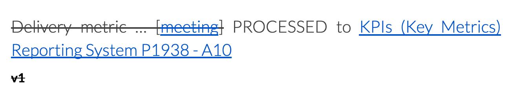

# Communications

This document is primarily about how we communicate *internally* at Datopian. To a lesser extent it is about how we communicate with partners with clients. It is *not* about outward-focused communications such as blogging, tweeting, etc.

We're fully distributed and remote. This means we need to put even more effort than usual into creating strong *explicit* patterns and processes for communication if we are going to function really well.

:::tip
Humans evolved in small groups with face to face communication so remote is challenging. In addition, we are doing complex knowledge work where **a)** communication is essential (in fact, in a sense, it is all we do if we think of coding as communication) **b)** we're communicating about complex things **c)** we're often doing this cross-culturally.
:::

## Media

We have the following *media* of communication:

* Call: voice or video, i.e. Google Meet.
* Chat (aka IM): text chat / instant messenger, i.e. Google Chat.
* Email: a conversation via email either one to one or in a group.
* Document: written documents such as Google Docs, HackMD, etc.
* [Issue tracker](https://playbook.datopian.com/issues-tasks/#creating-issues): combination of written text, checklists and comments, e.g. GitLab or GitHub issue tracker.
* In person: face to face.
* Zoom: video recordings and large meetings.
    * When scheduling a recurring meeting on Zoom, the recurrence time must be chosen: either daily, weekly, or monthly. “No fixed time” should NOT be chosen.

It's a big part of the foundation for great internal communication.

## Information Flow and Capture

We follow [Getting Things Done][gtd]:

* Information (and actions) get generated in a variety of places e.g. in a meeting, on chat, in an email, etc.
* That information gets processed to 4 places:
  * Trash aka no processing needed;
  * Project folder / documents;
  * Reference folder / documents;
  * Actions system (either personal GTD Inbox / Next actions or a group system such as an issue tracker).

[gtd]: [/getting-things-done]

For us

| Place  | Actual Location |
|--------|-----------------|
| Project | Individual Project folder in Drive |

### Examples

**You are having a meeting with a client**.

* You make notes during the meeting (all meetings SHOULD have meeting notes).
  * In either the shared meeting doc (if there is one) or the Datopian only meeting doc (if there is no shared doc).
* At the end of the meeting (or just after if there is not time) you summarize / clarify.
  * Actions & agreements: into specific sections in the meeting doc.
  * New project information: identify any new relevant project information (e.g. maybe there is a new piece of information from the client, e.g. Bob is joining the project or they are moving from cloud provider X to cloud provider Y).
* Email the client a summary of key points and any actions and agreements.
  * Even if *nothing* substantive, we recommend emailing an update so we have a record.
* Process the materials.
  * Actions => into issue tracker or similar.
  * Agreements => we recommend having a dedicated place for these agreements, e.g. in the project A10 (remember to date them and note when emailed to the client).
  * New project information => into project materials.

At this point, the meeting notes should be obsolete (and we need never refer to them again!).

TODO:

* You are in an internal video meeting to discuss a project.
* You are in a meeting with a client.
* You are working on a project and encounter a problem that you want help on.
* You are working on analysis or proposal for some activity.

## Principles & Goals

* KISS => reduce the number of channels.
* All substantive communication with clients should include a summary in written form usually via email.
* Use written documents rather than e.g. slides as the default for rich information presentation.
  * Why? See Tufte. In short: slides tend to break up the logic narrative fundamentally disrupting it and preventing adequate cognition and critique. Slides because of their structure to break up narrative or logical explanation arbitrarily into small chunks (the slides). They also tend to bullet-point-itis rather than make proper sentences, obscuring logical connection between statements.
* Every meeting SHOULD have a meeting doc.
* All materials from a meeting SHOULD be processed on the day of the meeting.
  * Strike through material that has been processed and note where it has been processed to ... 

What I'm noticing:

* Chat is default for internal communication with relatively little email.
* Chat (even more than email) MUST be paired with documents to be effective due to ephemeral, disorganized nature of chat (chat is NOT a knowledge base).
  * It is easy for chat to become *the* medium for information exchange *and* storage. This is a *bad* thing. Aka Slack is a Cancer.
  * Chat is potentially highly disruptive of work.

## Tools

* Chat => GChat
* Email => GM
* Documents => GDocs (or HackMD)

**Approach**

* Explain README, vs Scratchpad / Notebook.
* cf Glenn diagram for apprentice.

## HackMD and its Usage

TODO -- this is material from apprentice chats...

Start using HackMD here for planning stuff and especially analysis and actions:

* Because you can easily copy and paste from here into GitLab issues.
* You get to practice Markdown...
* We have *one* place.

For general meeting notes and discussions you can still use the GDocs Meetings Doc.

How to use this HackMD scratch pad...

* This is a *scratch* pad thus it is more for temporary work -- not for permanent recording.
* Thus, material should be moved out of here to a relevant location (or discarded) regularly (daily or every few days).
* For example:
  * Actions (checkbox items) => move to relevant GitLab issue (or, if minor, do them and discard).
  * Analysis and notes => move to either relevant epic or into some other document.

**Why Chat is not Info Management**

Chat: short, brief, ephemeral, interactive (or close to real-time).

* Sharing quick links…

Examples

* Informal chat / updates.
  * Hi, I’ve started work today => IM
  * Hey, have you seen the latest avengers movie => IM Random channel
  * It’s Y birthday, happy birthday Y => IM
* Here’s a cool article I came across => IM / Link list
* How do we do X? => Wiki / Q&A
* I don’t think our test setup works well, what shall we do about it => Wiki / Brainstorm
* No-one was on our management call, let’s restore integrity => to be discussed [email]
* Here’s our new tech strategy => [email / document]
* Hey X, can you help me with ABC in next day or so
* [Paul] Hey Esteban, I need these documents right now
* Hey x, I need these documents by a certain date
* Dear mge team, I need to notify you of an important financial issue

Summary

* Collaborative problem solving / brainstorming => Voice / Video + scratchpad
* Resolving a tech issue => Flag on channel or in daily meeting => collaborative problem solving [If significant we want to capture for the future… (tech Q&A)].
* [GTD] Inbox => Actionable…, reference, waiting for…  => use email for Inbox and/or issue tracker.
* Requests for work… [Needs SLA e.g. when is support request actioned and what is escalation].
* Notifications for people to read stuff.
* What’s the status [of the team] => Chat.

Desire: fewer channels.

Chat

* For chat -- informal, live interaction.
* Log of things in dedicated channel (e.g. standups).
  * Is it better than a big doc?
* Here’s something to look at…
* Live interaction about something
  * Even here: call + notepad is often better.
* Here’s this link (quicker than email) (but normally on a call and have a chat system…).
  * But esp team calls or similar…?

Inbox system = email or issue tracker (+ email to issue tracker) (NOT chat).

Work on stuff system: issue tracker.
