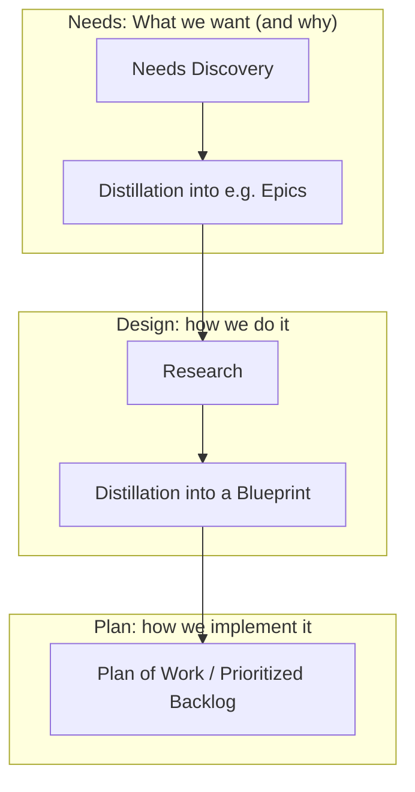
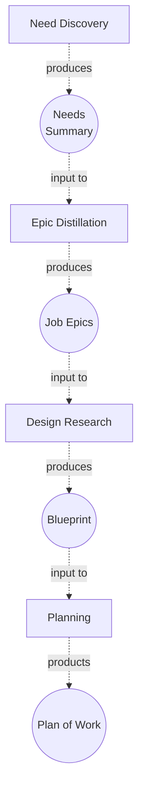
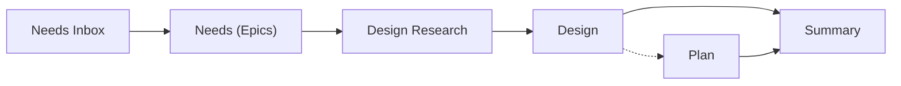

# Analysis: Needs, Design and Planning

We use the term "Analysis" broadly to cover:

* Distinguishing Needs
* Designing solutions
* Planning work

It is therefore a broader than just "requirements analysis" (capturing needs), it also includes designing and architecting solutions and planning implementation.

In keeping with a general agile approach, the analysis process should be kept in a healthy balance and iteration with implementation. In addition, analysis itself can cycle over its sub-stages: analysis feeds into design and planning, which, in turn, feeds back into further analysis.

Finally, we emphasize that analysis is applicable both to large projects and to a single simple task. Just as test-driven development is worthwhile even for simple changes, so analysis will pay dividends even for small script or a minor change to a website.

## Analysis in Context

Analysis is one part of the larger software development life cycle. It is the yin to the implementation yang. It is the "look before you jump" companion to "let's just code".


In agile fashion, the process is a loop as implementation leads back into analysis as new needs are discovered, or simply as more user stories are pulled down from the backlog for detailed analysis and planning.

Breaking this down in more detail we can see it clearly mapped against classic software development life cycle with its phases of: requirements analysis, designing architecture, development and programming, testing and deployment.


NB: we have drawn this to follow classic software development and omitted certain details. For example, testing (if we test-driven development) may come both before and after development etc. And, of course, implementation loops back into analysis.

## Analysis Overview

There are 3 sub-stages of analysis:

1. **Needs**: Capturing and distinguishing needs of clients and users
2. **Design**: Researching, designing and architecting a solution to address those needs utilizing and developing our (and others) tools and patterns
3. **Plan**: planning work to deliver that solution. This includes breaking down a design into tasks, clarifying their dependencies and estimating these (i.e. a roadmap).





## Distinguishing Needs

This approach borrows from the GTD "Inbox" and information processing pattern.

1. **Capture** *everything* you can into a Needs Document usually in a section called "Inbox". This is a brain dump type exercise where you capture as much as possible. This can include half-done user stories, emails, technical diagrams, requirements etc.
2. **Clarify** Process this information into distilled user or job "epics", i.e. high level summaries of needs in the form of [job stories][] (or [user stories][]).
    * You can start by inlining as much as is relevant from the inbox items into the document.
    * Organize that, pulling together common items.
    * Start creating User / Job "Epics" in a new section

At the end of this process you should have a set of high level epics with associated backup material (in bullet points or in an appendix).

Now that you have an initial set of needs you can move onto designing a solution.

:::tip
We prefer the term need or want to requirements. It helps focus on the overall desire of the user rather than the specifics of a solution.
:::

[job stories]: /job-stories/
[user stories]: /user-stories/

## Design and Architecture

In this section you design a solution. In software this may involve doing some degree of technical architecture: specifying components and their interconnections, component behaviour, etc.

1. **Research**: search for existing patterns and tools that address this kind of problem. How well do they fit, etc.
2. **Select and adapt**: select existing patterns and/or tools that can be adapted to this purpose. How do they fit together? What work is required to connect them? Are new bespoke components needed?
3. **Blueprint** design and architect an outline of the overall solution.

This process may again use the GTD Inbox + Clarify pattern with the research stage being "inbox-y" with a lot of quick capturing of ideas and tools followed by some annotation and analysis. It is fine if this research is quite messy as it is then followed by the clarification (select and adapt) into the design blueprint.

## Plan the Work

The final stage involves breaking down the solution into distinct tasks and clearly defining done in the form of acceptance criteria. It may also involve estimation of those tasks too.

Our usual process involves creating one of more task epics following the [issue / tasks template][issues]. Depending on the needs of the situation these epics may be more or less detailed and in some cases you may even break out explicit sub-tasks at finer levels of detail. This can be useful if accurate estimation is needed -- though beware of false precision.

## Examples

* [Client X Needs Analysis -- Jan 20](https://docs.google.com/document/d/19T4M93WnKiGSakC6V3k2xsbBJhjc4zxS6qXNckagcw4/edit).
* [Harvester Needs Analysis -- Dec 19](https://docs.google.com/document/d/1C9GrgJrRJcwT8ZbYIIggWpOd_paZqdxq_7J00-vUZHA/edit).
* [Full Data Download (EDS) -- Dec 19](https://docs.google.com/document/d/1yKK9_mRHC9-X9hN263OpjEKZb1jOOVDC5GYHdrCHam8/edit).
* [Quiz Format Research and Design](https://gitlab.com/datopian/experiments/quizzical/issues/2) -- this is a GitLab issue and is in the "epic" format for issues. It is a little messy but still gives a good sense of a real world analysis (this time to design a quiz format).

## Analysis Document Format

### Naming of Analysis Documents

Documents related to Analysis SHOULD be named:

`... [Needs] Analysis`

The `[Needs]` indicates that this optional. If the document is *just* needs information without design then Needs SHOULD be included.

For example:

`Awesome Data Portal Needs Analysis`

### Structure of Analysis Documents

The suggested *final* structure for an Analysis document is below in markdown outline. There is also a [Google Doc Template][template].

**Creation Process**: this *final* structure is designed for reading. It's section are *not* in the order you would actually do your work. In fact, you would generally work backwards through this structure adding sections as you go: you would start with Needs Inbox, distill that material into the Needs (Epics) section, then do Design Research, then distill that into a (Proposed) Design. Finally, you will produce the Summary which summarizes the needs (epics) and solution (design). In visual form:



```
# Summary

A summary of the needs and the solution.

Usually, starts with key needs followed with overview of the solution and key tasks.

# Needs

These are distilled needs, preferably in the form of job epics.

# Design

This is the design of the solution.

# Plan of Work [optional]

One or more structured issues as per the issue/task template.

--- Appendix ---

# Design Research

This is preliminary research for how to build a solution.

# Needs Inbox

This is where you collect all incoming needs related items prior to distilling them.
```

**Plan of Work**: this is an optional section. Sometimes you may add a Plan of Work section after the Design sections. This section breaks down the implementation work into actionable tasks following the [template for issues / tasks][issues]. This is optional (in this document) for two reasons: **a)** this may not be necessary until later (e.g. after the design is approved) **b)** this is often done in another document, e.g. a HackMD for easy transfer into issues in an issue tracker.

:::tip
When booting a document you may just want to start with Needs Inbox and Design Research and only add other sections as you come to them.

When finalizing you may want to mark these two inbox sections as obsolete in some way, e.g. by adding "Archive" to their names. Given their archival nature, when sharing the doc with third parties you may want to remove these sections or clearly separate theme to avoid confusion.
:::

### Templates

* [Google Doc Template][template].
* [Template for issues / tasks in markdown][issues].

[template]: https://docs.google.com/document/d/1a_KTb2d70odrl1EF12AOQ0zzfxlVcHObnUPhhdFtCAw/edit#
[issues]: /issues-tasks/

