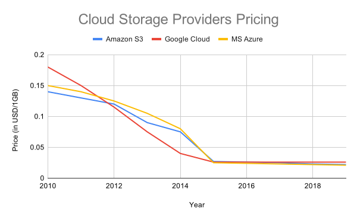

# How to Do Research

Doing research provides a systematic approach to answering any type of questions from: "What is the best power bank to buy for my smartphone?" to "What is the nature of reality?", any of those questions can benefit from doing it in a structured way.

## Lightning Tour

In the following video Rufus explains the research pattern and demo's how to get started on doing research:

<iframe width="740" height="416" src="https://www.youtube.com/embed/4QvqqFpY38k" frameborder="0" allow="accelerometer; autoplay; encrypted-media; gyroscope; picture-in-picture" allowfullscreen></iframe>

## What is Research

> Research is a **process of systematic inquiry** that entails collection of data; documentation of critical information; and analysis and interpretation of that data/information, in accordance with suitable methodologies set by specific professional fields and academic disciplines.
>
> Research is conducted to evaluate the validity of a hypothesis or an interpretive framework; to **assemble a body of substantive knowledge and findings** for sharing them in appropriate manners; and to **generate questions for further inquiries**. [^hampshire]

* **Process of systematic inquiry.**
  That means there is a structure to it, which we will cover with the patterns below.

* **Collection of data; documentation of critical information.**
  Information is gathered, collected and documented somewhere in a way it is shareable with others so they can learn from it or contribute.
  
* **Analysis and interpretation of that data/information.**
 From the information that was gather and collected knowledge and insights can be gained.
  
* **Generate questions for further inquiries.**
 By gaining more knowledge about the topic throughout the process, further questions for extended or future research can arise.
  
[^hampshire]: https://www.hampshire.edu/dof/what-is-research

## Pattern: Breadth, then Depth

### Context

You want to research a certain question.

### Problem

If you start your search in a search engine, library, or elsewhere, there is a vast amount of information available on many subjects. A lot of the information or jargon you find might be new to you and you don't know yet which sources are good.

### Solution

You start out by doing a broad search first, i.e. breadth-first search. You want to get an overview of the land.

First step would be to open a scratchpad (e.g. HackMD, GDocs, notes app...). Get clear on the research question and start your search, for example when using a search engine, you start out with a certain query and quickly glance over the sources and start collecting the sources that look promising by writing the links and some notes in the scratchpad.

While you are searching you might get more familiar with the language around the research topic and might get ideas for more detailed search queries and find more sources that way.

You might also start to notice patterns, sources that are often referenced or generally get a better idea when a source looks good.

Once you've identified a couple of potentially great sources, then you go in depth, i.e. you now study those more closely.

## Structuring Into a Spreadsheet/DB

Once you've gathered a reasonable amount of data, you start organizing your data, this will involve moving the data to a spreadsheet/database. This process wil require you to think about what criteria/key dimension you will evaluate on, e.g. range or mileage if you're evaluating cars.

Ultimately you want to get a structured overview that allows you and anyone new to have an overview of the data and spot any patterns present in them.

Some guidelines:

* Try to use boolean values for indicating when something is present in the data -- e.g. a 'supports markdown' column -> Yes/No values instead of writing 'supports markdown' as the value.

| Supports Markdown | Format                    |
| ----------------- | ------------------------- |
| Yes               | Supports Markdown         |
| No                | Does not support Markdown |

::: tip
Note that 'yes/no' columns are not always the best option. For example, say you are reviewing content management systems and you want to log whether it is easy for non-techy people to post content on them. Just because a non-techy person may be able to post content on a CMS does not mean that it is easy; maybe it would take them a lot of time and effort, even if they could do it after hours of trying. In this example, the value you would want to log is the _ease_ of posting, which you could log on a scale eg. 1-10. You may even want to break this down into different criteria, such as how easy is it to manage media or to edit once a post is up.
:::

* No blank rows.
* Start with the basics: URLs to the product, breif description, pricing.
* Don't put meta data at the bottom of the table.
* Avoid having multiple columns in one sheet.
  * If you do, have them side by side because if you have them above or below each other then if you add or delete a column in one of the tables it might mess up the other ones.
* If you have 1 column which contains the same values for all entries, generally you can leave it out because it doesn't convey anything.
* If a colleague asks you to carry out a research task to compare different products, it is a good idea to present a recommendation as part of your deliverable. They may disagree with your choice, but heating your own reasoning may help them consolidate their own opinion.
  * If you are required to present your findings during a meeting, it may also be a good idea to post any relevant screenshots in the corresponding issue to demonstrate your point while you are talking.

## Job stories

One of the most important things to work out over the course of your research is the criteria you are going to choose to compare different options. Instead of randomly plucking sensible criteria from thin air, you need to think about the information that is actually important for your decision-making process. To do this, you need to consider what your job stories are.

For example, say someone asked you to research cars. You might think to include basic criteria like engine size, colours available, how many passengers it can carry, whether it had bluetooth. However, if you don't have a smartphone and you don't care about what your car looks like, then criteria such as bluetooth and colour availability are not going to be very relevant criteria for you to assess. However, if one of your job stories is that you need to be able to only want to have to drive for miles each time something goes wrong with your car, a good criteria might be the distance to the nearest local car dealer.

## Worked Out Example

As an example we'll take the cloud storage time series research question, see [Issue 58 in Apprentice Program](https://gitlab.com/datopian/dojo/apprentice-program/issues/58) for the original request.

The research question here is: *Which cloud storage provider offers the best value for money and how has this changed over time?*

A key outcome of this research was a time series chart detailing the price evolution of the 3 major cloud storage providers for the last 10 years.

This chart is based on the data from the table below:

| Provider     | Year | Price (in USD/1GB) |
| ------------ | ---- | ------------------ |
| Amazon S3    | 2010 | 0.14               |
| MS Azure     | 2010 | 0.15               |
| Google Cloud | 2010 | 0.18               |
| Amazon S3    | 2011 | 0.13               |
| MS Azure     | 2011 | 0.14               |
| Google Cloud | 2011 | 0.15               |
| Amazon S3    | 2012 | 0.12               |
| MS Azure     | 2012 | 0.125              |
| Google Cloud | 2012 | 0.115              |
| Amazon S3    | 2013 | 0.09               |
| MS Azure     | 2013 | 0.105              |
| Google Cloud | 2013 | 0.075              |
| Amazon S3    | 2014 | 0.075              |
| MS Azure     | 2014 | 0.08               |
| Google Cloud | 2014 | 0.04               |
| Amazon S3    | 2015 | 0.027              |
| MS Azure     | 2015 | 0.025              |
| Google Cloud | 2015 | 0.026              |
| Amazon S3    | 2016 | 0.026              |
| MS Azure     | 2016 | 0.024              |
| Google Cloud | 2016 | 0.026              |
| Amazon S3    | 2017 | 0.025              |
| MS Azure     | 2017 | 0.023              |
| Google Cloud | 2017 | 0.026              |
| Amazon S3    | 2018 | 0.023              |
| MS Azure     | 2018 | 0.022              |
| Google Cloud | 2018 | 0.026              |
| Amazon S3    | 2019 | 0.022              |
| MS Azure     | 2019 | 0.021              |
| Google Cloud | 2019 | 0.026              |

In order to get to the structured data in a table format like above, a couple of questions might come up:

* Who are the major cloud storage providers?
* How do we define best value for money?
* How do we get historical pricing data?

Any question that comes up you note in your scratchpad and after a while when you gathered enough information in the breath part of your search, you start compiling it down and go more in depth and start structuring it in a spreadsheet.

In this case, since we're looking at cloud *storage*, the key unit of measure is *storage* capacity e.g. Gigabytes (GB) or Terabytes (TB). In order to easily compare between different providers, we use a metric which is the price per 1 GB of storage capacity.

This is similar to what you sometimes see in supermarkets, where they recalculate the price and show it per unit of measure of the bottom of the label. For example, nuts **A** come in a bag of 500g for € 10 and nuts **B** are 333g for €7, so nuts **A** are €20/kg and nuts **B** are €21/kg. The per kg pricing allows you to quickly and easily compare nuts **A** vs nuts **B** and you then know nuts **A** are cheaper.

Once we have the data in a structured format, i.e. a table, we can visualize the data in a chart which makes it much easier and more clear to be able to answer our original research question in a meaningful way.

In the following video you can see Rufus' feedback on this very example that the apprentices of cohort 2 did:

<iframe width="740" height="393" src="https://www.youtube.com/embed/aR8YngvoggQ" frameborder="0" allow="accelerometer; autoplay; encrypted-media; gyroscope; picture-in-picture" allowfullscreen></iframe>
