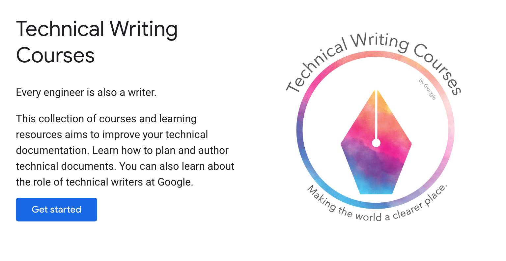

# Technical Writing

As a software engineer, you read a lot more than you write. This written communication doesn't happen only through code – you write in Google Chat, in issue trackers, in documentation pages, and even in Git commits! Thus, it is important to communicate effectively in English as well. Remember that many readers are not native speakers of English, so please be thoughtful with your colleagues, and take extra care when proofreading.

Google recently released a short course on Technical Writing. When you have a few spare minutes, you can browse it, take notes, and start practicing the guidelines.

<figure class="image">
  
  <figcaption>Source: <a href="https://developers.google.com/tech-writing">https://developers.google.com/tech-writing</a></figcaption>
</figure>

## Recommendations

[Here](https://developers.google.com/tech-writing/one), you will find a shortlist of their recommendations:

* Use terminology—including abbreviations and acronyms—consistently.
* Recognize and disambiguate pesky pronouns.
* Distinguish active voice from passive voice.
* Convert passive voice sentences to active voice.
* Identify three ways in which active voice is superior to passive voice.
* Develop at least three strategies to make sentences clearer and more engaging.
* Develop at least four strategies to shorten sentences.
* Understand the difference between bulleted lists and numbered lists.
* Create helpful lists.
* Create effective lead sentences for paragraphs.
* Focus each paragraph on a single topic.
* State key points at the start of each document.
* Identify your target audience.
* Determine what your target audience already knows and what your target audience needs to learn.
* Understand the curse of knowledge.
* Identify and revise idioms.
* State your document's scope (goals) and audience.
* Break long topics into appropriate sections.
* Use commas, parentheses, colons, em-dashes, and semicolons properly.
* Develop beginner competency in Markdown.

## Key Highlights

We still have a lot to learn, so please submit pull requests if you learned something already applicable to existing documentation. The following is a non-exhaustive list of things to pay special attention:

* [Define new or unfamiliar terms.](https://developers.google.com/tech-writing/one/words#define_new_or_unfamiliar_terms)
* [Use terms consistently.](https://developers.google.com/tech-writing/one/words#use_terms_consistently)
* [Use acronyms properly.](https://developers.google.com/tech-writing/one/words#use_acronyms_properly)
* [Choose the correct type of list.](https://developers.google.com/tech-writing/one/lists-and-tables#choose_the_correct_type_of_list)
* [Determine what your audience needs to learn.](https://developers.google.com/tech-writing/one/audience#determine_what_your_audience_needs_to_learn)
* [State your document's scope.](https://developers.google.com/tech-writing/one/documents#state_your_documents_scope)
* [State your audience.](https://developers.google.com/tech-writing/one/documents#state_your_audience)

## Learn More

Are you still eager to learn more about this subject? You can start by the studying the following pages:

* https://developers.google.com/tech-writing/
* https://numpy.org/neps/nep-0044-restructuring-numpy-docs.html
* https://carpentries.github.io/instructor-training/15-lesson-study/index.html
* http://technicalcommunicationuk.com/wp/wp-content/uploads/2018/10/Daniele-Procida-%E2%80%93-Four-functions-in-the-structure-of-technical-documentation-and-why-they-matter.pdf
