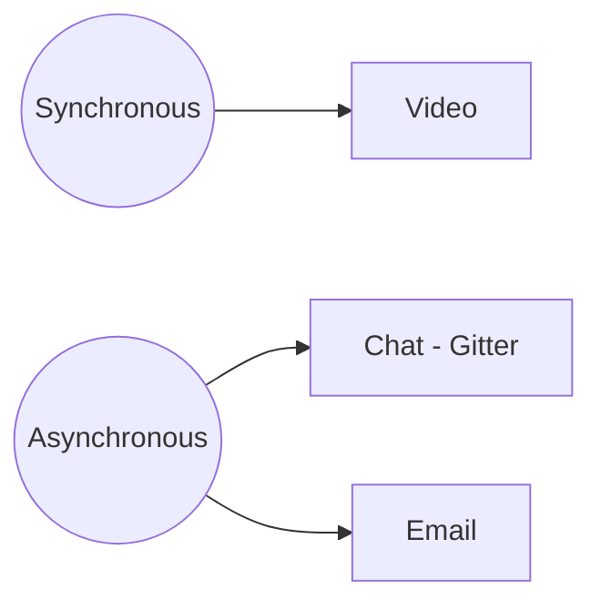
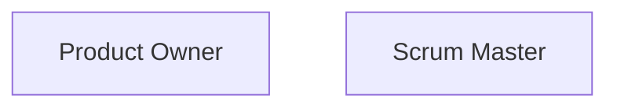
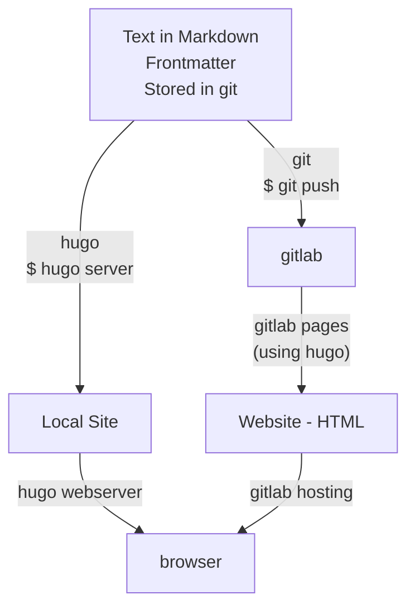
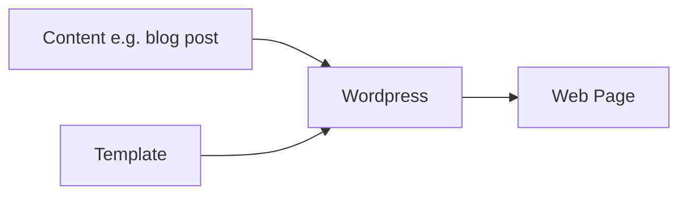
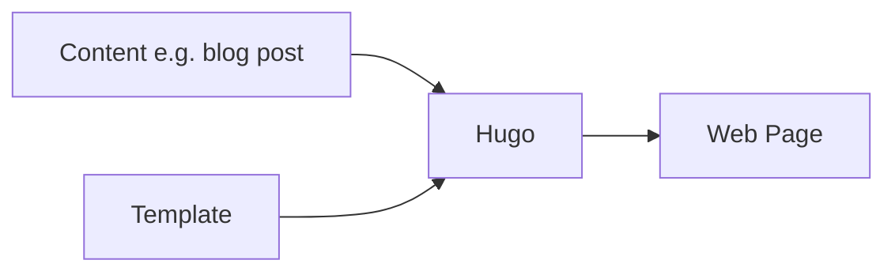

# Introduction and Overview

This is our team handbook. It is our guide to the systems, processes and patterns for getting things done.

We value judgment over rules. Patterns over processes, processes over systems. This means, for example, we put effort to explaining *why* we do things not just *how* we do things. 

We value parsimony and one way to do things. We prefer fewer systems and fewer things to know. We are happy to spend time refining and automating our processes and patterns.

In short, we value Zen - deep simplicity, nothing to add and nothing to take away. Essence, precision, elegance, rigour, frictionlessness.


[[toc]]


## Our Principles

### 1. Integrity, Authenticity and Commitment to Something Bigger than Yourself

*An object has integrity when it is whole and complete. Any diminution in its wholeness and completeness results in a diminution in workability. Think of a wheel with missing spokes, it is not whole, complete. It will become out-of-round, work less well and eventually stop working entirely. Likewise, a system has integrity when it is whole and complete.*

*Recommended reading - [A ‘Value-Free’ Approach To Values](  https://drive.google.com/file/d/0B4VpjxPkN_XcXzRmSU5HR2lMVm8/view)*

#### Integrity

**Honouring your word** - Doing what you said you would do **or** whenever you will *not* be keeping your word you get in action restoring your word with everyone impacted. **Why is it important** - it is the bridge to workability and performance.


**Restoring integrity**
* You acknowledge the word you gave (your promise)
* You state matter of factly what happened (no justifications)
* You look at the impact on others and yourself of not keeping your word
* You say what you will put in place in future


| Steps | Example  | Example *(NOT working)* |
| -------- | -------- | -------- |
| 1. You **acknowledge** the word you gave (your promise)| *I said I would meet you for lunch at 1pm*  | Hi, hope I’m not late. | 
2. You state matter of factly what happened (no justifications) | *I arrived at 1:27pm* | *You would not believe what happened with the trains, it was a nightmare.* | 
| 3. You look at the **impact** on **others** and **yourself** of not keeping your word | *I imagine you have been concerned whether I’m coming, and probably annoyed and frustrated about my lack of punctuality and being kept waiting around. For my part, I’m stressed and rushed and feeling guilty about not respecting your time.* | *Hope you haven’t been waiting long.* | 
| You say what you will **put in place** in future. *This must be something “external” to yourself.*  | *"I will set a calendar reminder 10m before my meetings”* rather than *“I will try harder to be on time”* (this is intrinsic and we assume you tried your best this time – we always come from a place of assuming you did your best)

### 2. Initiative 
Take initiative and responsibility. We are agile and we want everyone to take responsibility and initiative. Be bold, be responsible.

### 3. Communication
We commit to be in communication and to provide feedback so we can both improve. If an issue arises we will raise it promptly so it can be addressed. We do not gossip. 

## Agreements
A. We may need to learn some new tools together. We will take this into account. At our end, we may expect you to do some learning and practice on your own time.

B. We will have the opportunity to learn from each other's experience.

C. You commit to make yourself available for planning together online on video calls. You also will ensure you have a high quality internet connection so we can do video conferencing on Google Meet (meeting links are automatically created for each meeting).

D. If required, you will install a unix-based operating system such as Ubuntu (Mac OSX is already unix based). This can be dual-boot. You will need to be responsible for installation and maintenance in your spare time.


## Communications

Intention and context: *as a virtual organization we need to have efficient, reliable, cost-effective way to communicate and share material.*

### Transparent Communication Guide

#### What is Transparent Communication - how does it works?

Transparent communication is a way to share information across all team members of a company. It will be used across platform such as Slack and emails.

Transparent communication goal is to help all team members to be fully informed and understand what is going on within the company. Benefits include:

* Better connection of team members, better communication and understanding of each other,
* Better understanding of company's processes and workflow,
* Increases responsiveness and productivity,
* Decreases failures, mistakes and oversights,
* Helps new team members learn and socialise faster and
* Builds comfortable and trustful working environment that spurs innovation and experimentation

#### Policy and practises

To keep things fully transparent across our team, we have put some practises in place that will ensure that:

* We are using groups (which are internal mail lists) for different aspects of our company.
* We are cc-ing and bcc-ing those groups when communicating via email
* We are using \*\*Inbox Filters\*\* ( e.g. a **@blackhole**  parallel Inbox, where you will receive the emails you might not have direct relevance or )

### Communication Tools



* **Chat** - We use [Slack](https://slack.com/) 
*A networking platform online (or download the app) where we have different rooms for different projects/purposes.*
*(Based on the transparent policy, we require people to speak publicly in the related group and @ the people you want to talk instead of texting privately, unless it is a personal chat.)* 
* We also use [Gitter](https://gitter.im/) -  this is  used by developers or SM/POs who are working on Datahub.io or Frictionless data. 


* **Voice / Video calls:** Our default tool is Google Meet - video call links are automatically added to every meeting set up using our Google Apps calendar.
  
  *Face to face communication is a big deal for humans. Facial cues are very important. Always prefer video over voice for synchronous.*

* **Email** - we use Gmail
* **Documents** - GDrive for all internal documents, Hackmd can be used when working with partners.


### Datopian Contact Information

For **ALL** office/finance/admin related inquiries, please email: **office@datopian.com**


## Default Styles 

We want our documents to look neat and coherent so we set up a Style guide for Datopian. Follow the links below to see the steps on how you set it up for your Drive:


For **Documents:**


* Go into  [Doc Style Template](https://docs.google.com/document/d/1oOMD9l0fRpYKiYd0zf0MQsiP8URce3WFSPUHmYGN428/edit) (Drive: *Eydean Inc. -> Projects -> Eydean 2018-> Team Eydean Inc. - Team guide* 
* Click the tab *Format - Paragraph Styles - Options - SAVE as my default styles*
* Update the page after saving as your default styles (just to make sure it got saved)
* Open a new document
* Click the tab *Format - Paragraph Styles - Options - USE my default styles*
* Start writing. 
* Double check you got it correctly:
    * Font and Headings - “Open Sans Light”
    * Text - “Palatino”
    * Line spacing - 1.5
    * Text size - 12

*If that doesn’t work:*
If you have some difficulties to update your documents with our default style set up you might have to do it manually. 
 
To make sure the text format has been updated:
* Click on the box “Normal Text” and you will see if the drop down text matches the one we have set up.

If not:
* Go back to the Font Demo Eydean Inc.
* Highlight ‘Eydean Inc. Style Guide’ in text
* Go to the box ‘Title’ -> Click: the arrow on your right -> click: Update ‘Title’ to Match
* Follow the steps for below by highlight corresponding text in document and ‘Update X to match” : 
    * Subtitle
    * Heading 1
    * Heading 2
    * Heading 3 
    * Heading 4
    * Normal text 

* Then click the same box as above and click: Options - Save as my default styles


## Team 

### Core Hours

Our general working hours are 8am UK - 4pm UK. Not necessarily when you work but when it is permissible to schedule meetings. 

### Phone book 

A place where phone numbers, usernames, phone numbers etc can be found: 

[Datopian Team Phonebook](https://docs.google.com/spreadsheets/d/1hFw3jFHq_TF4m_Z76n0uzBz85UB9Yht4P2IZAPicBOI/edit#gid=129072431)


### Holidays

Taking time off to recharge and spend time with loved ones is encouraged. We ask that you be mindful of business priorities when choosing which days to take off and liaise with you scrum master / product owner. 

To notify us of a holiday:

* Talk to your Scrum Master / Product Owner 
* Once agreed then write an email to office@datopian.com and inform them about the dates and the length of your absence.
* Make sure to add your holiday dates in our [Datopian Team calendar](https://calendar.google.com/calendar?cid=dmlkZXJ1bS5jb21fbzhlbWhqMmJvZmptamF1YTE0cDYzbmlkbzBAZ3JvdXAuY2FsZW5kYXIuZ29vZ2xlLmNvbQ).

### Sick leave policy

If you’re not feeling well and you’re unable to perform your duties, notify your Scrum Master / Product Owner as soon as possible. The notified person will then let teammates know.

Please add an out of office and include an alternative contact. 

### Travel Arrangements:

All business-related travel arrangements must be approved by a member of the Leadership team. Once approved, you need to send an email to office@datopian.com and include the following:

* Exact dates of the business trip
* Location and address of the event you will be attending
* Any specific preferences in terms of transportation or accommodation 

The Office team will book the transportation and accommodation for you and forward you the details via an email. For all other expenses, you must keep the receipts in order to be reimbursed [See **Expenses** section ](https://handbook.datopian.com/guide/#company-expenses)


### Time tracking

Our appraoch to time-tracking reflects our principles: Trust in our employees, transparency with clients and lean processes. 

All team members should complete [Time tracking entry sheet](https://docs.google.com/spreadsheets/d/1SvXG-q_TLGkIiy8YTh2AewmyecG6Tw8xfjM-sXncvK0/edit#gid=0) by the end of the week every week providing their hours aggregated on a weekly basis.

Some projects require more granular reporting. Your Scrum Master will advise what if there are additional requirements for a particular project 

## Finances

### Getting Paid


#### Team invoicing on Xero:

-   Before the invoicing process, you will be invited to Viderum Xero. You should accept the invitation and set up your password.
-   NOTE: If team members invoice us by the 2nd of the month we will initiate the transfer by the 4th. If they submit their invoices by 7th of each month we will initiate the transfer by the 11th latest.  **Those who don't submit their invoices on time will simply be paid the following month.** 
-   You can either use the approximate days spent as the Qty and your effective daily as your Unit price or you can put the Qty as 1 and then used the Unit price to allocate your pay between different projects. Eg if your salary was $2,000 and you spent 50% of time to Project 1, 30% on project 2 and 20% on project 3. Then you would have 3 lines with an Unit price of $1,000 for Project 1 and $600 Project 2 and $400 Project 3.
-   The *amount* will automatically calculate based on the *Unit price* and *Qty*
-   -   - **Change in process wef 1st June 2019** You need to enter the number of hours worked as the *Qty* and your effective hourly rate as your Unit price.  Eg if your contractor fee per month is $2,000 and you worked 40 hours for project 1 and 120 hours for project 2 then you would split your contractor as per the example below:


| Qty | Unit price | Amount | Account | Projet | 
| -------- | -------- | -------- | ------- | ------- | 
| 40     | 12.5     | $500     | COS 5111 | Project 1 | 
| 120     | 12.5     | $1,500    | COS 5111 | Project 1 |

 -  Continue as per usual
-   Team member **Invoice** instructions:
    -   Log in with your account
    -   Click on ‘Dashboard’
    -   Scroll down to ‘New Bill’ and click on the button.
    -   Fill out ‘New Bill’ :
        -   *From*  - Your name
        -   *Date* - last date of the billing month. (It would be better to put the date of the bill on the month you bill for, even if you make the invoice after that month. The reason is that it makes it easier for project management and budget planning.)
        -   *Due date* - 7th of the next month
        -   *Reference* - Start with 001, following month 002 and so on.
        -   Double check you get the ***correct currency*** This is by default US Dollars, please only change if a different currency has been agreed in your contract 
        -   Add ‘Tax Exclusive’ in the *Amounts Are* box on the right hand side
        -   *Item* - Not required
        -   *Description* - Contractor fees for Month Year 
        -   *Qty / Unit Price* Please refer to example above point above.
        -   *Account* - 5111 -COS - Contractor - if most of your time is spent on billable projects, or if not, use 6331 - Contractors;
        -   *Tax rate*\- choose - 0% Tax on purchases
        -   *Project* - Scroll down to the one specific project where you spend the majorty of your time working on _(**Please always remember to add project.**)_ (If you have worked for different functions, please make different lines with the correct account and the clear description in the description box.)
        -   Please also remember to include your PDF invoice.
        -   Please check that the total amount invoiced (bottom right) matches to your attached invoice. 


### Company Expenses

If you have any company expenses to be reimbursed for:

 * Attach a copy of the receipt (expense) by clicking on the A4 paper next to Reference. (Make sure amount, date, merchant are readable)
* Please put a description for each invoice.
* When travelling for work: If you have expenses in different currencies for that month, convert the expense in XE.com into the currency you are paid in.
 *  Add a new line for separate currencies. EG: If you are paid in GBP; a metro ticket and lunch in GBP can be on one line and make a new line for bus ticket and train in Euros converted GBP.
*  Please remember to specify in the ‘Tax Rate’ box ie *Amounts are*; **Tax Exclusive** and Tax rate as **Tax on Purchases 0%** (we are all self-employed)


### Finance / Office Team ONLY

See [Accounting & Finances Guide](https://docs.google.com/document/d/1rSLj081NKkWPkR0Ys3ZVTy0tkFEr3pcJ-W86ajhchbg/edit#heading=h.qy0fklx1v9sk)
See [Step-by-step Induction for new team member](https://docs.google.com/document/d/1vlNYR-kGvOWFd2VRuR9qi0Cp8Q1i22A9Ct3uGAPNjOs/edit?usp=drive_web&ouid=107379996189258597736)


## Planning and the Sprint Cycle

TODO: think about how we integrate and adapt the RP PM guide.
[TODO: This link is obsolete, remove:] READ FIRST: http://github.com/rufuspollock/project-management specifically:

[TODO: Below links should be merged here or removed as currently partly contradicting with the content in the handbook.]
* User stories - https://github.com/rufuspollock/project-management/blob/master/user-stories.md
* Project delivery - (scrum-based): https://github.com/rufuspollock/project-management/blob/master/project-delivery.md

Roles:



### Sprint Planning

For new sprint, Product Owner:

* Ensure a milestone for the next sprint and the one after that[^why]
* Created issues on GitHub, in proper repos and correctly labelled **with**
  * Set of tasks in a checklist format
  * Section with "Acceptance criteria" checklist
* All issues are moved to 'This Sprint' column
* Written a proposed "sprint goal" - 1-3 sentences summarizing what we want to achieve

[^why]: At any given time we want milestones to exist for current sprint and one after it. Why? So that anything urgent or important [TODO: needs updating]


### Every Sprint Cycle

* Complete the [metrics][]

[metrics]: https://docs.google.com/spreadsheets/d/15pAupQDACTd8xK0rbW616u_t8h7b3JR5MBO4otFMrIg/edit?usp=drive_web&ouid=107379996189258597736

### Sprint Reviews

#### Before review starts

Each "scrum master" (with their team) has

* Reviewed the board and issues, moving everything that is done to done etc and adding a final note that is understandable about the state of the task
* Written a short summary in the planning doc about the sprint - what happened, was the sprint goal achieved, any learnings.

#### After review is complete with Product Owner


  Summarized total time spent against estimated and noted any planned tasks that were incomplete and added this time to the [metrics](https://docs.google.com/spreadsheets/d/15pAupQDACTd8xK0rbW616u_t8h7b3JR5MBO4otFMrIg/edit?usp=drive_web&ouid=107379996189258597736) tracker in 'Status Centre' Google sheet:
    * **Tab - Sprint metrics:** Extracted the points from your Trello board and inserted 'Planned Points' (beginning of sprint), 'Planned Points - End of sprint' and 'Hours'.
    * **Tab - Timesheet:** The hours and points per project. 
* Keep all remaining open issues either in 'This Sprint' column (if work is to continue) or move to 'Next Sprint'/'Inbox' (this may happen as part of sprint planning)
* Closed all relevant milestones


Scrum-master:

* Check everyone has neither too much nor too little scheduled in next sprint

## Issues / Tasks

Some of this material is covered / duplicated in this OKI coding standards proposal https://github.com/okfn/coding-standards/issues/17

### Creating Issues

This key information should be present:

* Short description: of what is involved. A user story if possible
* Acceptance criteria: what would it mean for this to be done
* Tasks/Checklist: A list of tasks involved in doing this task. If you don't know a first task should be "Analyze this and get set of tasks"

::: warning
This specific markdown structure is specific to issue trackers like those on github or gitlab. For Trello you can use checklists for Acceptance Criteria and Tasks.
:::

```
Short description of bug or feature need preferentially in a user story form. 

[Can have multiple items esp if an epic]

### Acceptance Criteria (for epics or "big" issues)

* [ ] ...
* [ ] ...

### Tasks

*Task list*

* [ ] ...
* [ ] ...

### Analysis

*This section is optional. It is where you provide further analysis of the problem and analyze potential solutions, ending with a recommendation and tasks (the tasks are usually moved out into the tasks section above)*
```

All issues must be properly labelled:
- Support issues must have a support label (indicating their support package)
- All client related issues must have a client label (all colored #800080)
- Issues related to other, internal, projects need to be labelled accordingly
- Contextual labels are encouraged:
  - 'Source' labels for support issues (e.g. client/sentry/uptime etc.)
  - 'Technical Debt', 'Bug' etc. 

Make sure you record relationships between issues, e.g.
- Individual issues and their epics
- Support requests and their fixes

:::tip
Use keywords such as 'parent of #...', 'child of #...', 'depends on #...' in the issue description to automatically create these relationships.
:::

::: tip
On Github (and Gitlab) you can create an issue template so this structure is always present.
:::

#### Issue Naming

* Put [epic] prefix in title for epic issues
* (Optional) Grouping ... e.g. `[ux]` for ux issues

### Estimating

**Github:** Using Waffle you can add estimates. These should be in hours. Epics: your estimate for an epic should only be for time on subtasks **not** included in subissues.

**Gitlab:** Estimation support is built in.


### Closing Issues

When closing issues you should leave a comment like this so that readers (including you later) are clear at glance what the outcome was and why, including being able to locate quickly any outputs produced as part of resolving the issue.

```
FIXED | INVALID | WONTFIX | DUPLICATE. *Insert
your comment about what resolved this with links or issue references.*
```

Example:

```
FIXED. See commit {link to commit} and staging  {link to page on staging that was changed}.
```

```
WONTFIX. This is not worth doing as the benefit is minor and a lot of work to implement e.g. we have to change the whole way we do search.
```

Notes:

* When issues are closed in a commit you do not need to add a separate comment.
* If `INVALID, WONTFIX, DUPLICATE` also assign the relevant label. Why? Labels show up listing and comments don't. Conversely label is not obvious when reading the issue comment thread

::: tip
Use the 'Fixes #...' keyword in your commit messages (or pull request descriptions) to automatically close issues when a PR is merged.

You can refer to issues in another repo by using the full notation, e.g. 'fixes ViderumGlobal/PM#10'
:::

### Commit messages' format

```
[ex][m]: plotly json examples - fixes #23.
```

That is:

* a tag: [ex] this is an example - you make these tags up and use them consistently.
* a size: [m] a size of this commit one of xs s m l xl
* a short descriptive sentence of what you did. I need this as well as what issue this refs as I need to be able to understand the commit on its own without reading something else.
* Finally anything that involves referencing or closing a github issue. e.g. refs #xx or fixes #xx (fixes and closes are synonymous so use either one)

So command would look like this:

```
git commit -m '[ex][m]: plotly json examples - fixes #23'
```

## Standups

Standups are a means to keep everyone updated with what you're up to.

Purpose:

* keep team in sync
* surface blockers
* deal with issues arising (e.g. need to reprioritize in face of an arising issue or change in estimate)

Each person needs to write

* What is my plan for today?
* What did accomplish yesterday?
* Do I have any blockers? 
* What is my availability for today?

We write these standups on the #standup channel on Slack, whenever we start our working day.
A standard template for updated is pinned to that channel.

## Meetings

* For all meetings we should have a meeting doc. Usually if meetings are regular we have a single meeting doc for all those meetings (i.e "Admin meeting doc") and we then update by adding new date of the meeting. 
* Please use the [meeting template](https://docs.google.com/document/d/1HIzMGA8_UV3bQL_uMgdvjY8P_fD3nw3-SWFHiu4_NZc/edit#heading=h.g8hq0h2xwr6b) so that our meeting documents are clear and consistent. You should COPY the template instead of editing it directly.
* Structure is as follows:
  * List date (we often use the date as the heading for the meeting if we have a document with multiple meetings in it)
  * List who is present
  * Goals: a meeting **MUST** have a short list of goals for that meeting. These are what you plan to achieve out of the meeting. Start the meeting by reviewing (or establishing) the goals.
  * Agenda: `a meeting **SHOULD** have an agenda (a short list of items to cover)
  * Decisions & Actions (tasks that are assigned)
  * Notes 

Here's an example layout in markdown

```
### 16 Jan 2017

Present: X, Y, Z

Goals:
* Plan the next week of work
* Pick a date for our team meeting

Agenda:
* Planning
  * List the main projects for the next week of work
  * List key tasks for each project
  * Prioritize each project
  * Check time allocated against availability
* Date of next meeting

Actions:
* Agreed on next meeting to be held in 2 weeks, James to schedule
```

## User Stories and Analysis

User stories are a great way of gathering requirements in an agile environment, where one of the key values is responding to change over following a plan. They are a good anchor for conversation that can then take place at the right time.

A user story is a short sentence that encapsulates three things:

* Who?
* What?
* Why?

**User story template:** 
*As a < type of user >, I want < some goal > so that < some reason >.*

SEE: https://github.com/rufuspollock/project-management/blob/master/user-stories.md

## Appendix

### Markdown

Markdown is a way to style text on the web. You control the display of the document; formatting words as **bold** or *italic*, adding images, and creating lists are just a few of the things we can do with Markdown. Mostly, Markdown is just regular text with a few non-alphabetic characters thrown in, like ## or *.

**Guide and tutorial:**

* https://www.markdowntutorial.com/
* http://commonmark.org/help/

### Tech School

*Sharing our learnings*

https://github.com/datopian/pm/issues/25

### Essential Software and Programs

#### Accounts

- Chrome and Firefox installed on computer
- Google account 
  *We will not always do this for contractors. Often, during initial period we will let them use their own gmail account and will not provide access*
- Shared Calendar
- Datopian standard [styles for google docs](https://docs.google.com/document/d/1Cb0GFU0jMVRXqrk4wAJ_DQZkBFxQNBCchCv15mB81Ac/edit) (you have to update your google account with these styles)
- Access to root Datopian folder (and add that to your drive)
- [Trello](https://trello.com/)

  * [Scrum for Trello](http://scrumfortrello.com/) *(adds estimates or record time-spent directly on Trello cards)*
* [Gitter](https://gitter.im/) *(Chat hub)*

#### Tools

* [GitLab](https://about.gitlab.com/) Acc *(Hub for developers to store, share and manage their codes)*
* [GitHub](https://github.com/) Acc. *(Hub for developers to store, share and manage their codes)*
* [Zenhub](https://www.zenhub.com/) [dev] *(Extension for Github and provides some cool project management tools)*
* Forestry.io *(a Git-backed content management system for websites and web products built using static site generators.)*
* Amazon Web Service - *(provides number of cloud based instances)* [devops only - not essential]
* Heroku acc. [devops only - not essential] *(cloud based service (server) for your web application and make it live)*
* [VSCode](https://code.visualstudio.com/) *(great free code editor)*
* [Atom editor](https://atom.io/) *(text editor with some cool features)*
  * Markdown preview extension for Atom - [markdown-preview-enhanced](https://github.com/shd101wyy/markdown-preview-enhanced) 
  * [Floobits for Atom](https://floobits.com/) *(Cross-editor real-time collaboration extension for Atom, where two or more coder can work on same code together)*
* [Hugo](https://gohugo.io/) *(an engine (tool) for making a website)*


### Access to systems

We use Bitwarden.com to manage credentials and passwords to access key company systems and platforms. If you require access to a particular system get in touch with a relevant colleague (e.g., if you need access to Google Cloud for DevOps contact a senior DevOps engineer) or contact office@datopian.com.


## How our Websites Work

1. Content => Html
2. Serving html to browsers (webservers, DNS = domain names)
3. Collaborate on writing that content

**UPDATE: here is a guide focused on iMed: https://docs.google.com/document/d/1o_jS7bmKWiqfymfppk_E58zU-Yz9sdoXtf4GiPBmK2M/edit**

### How is a website built ...








### How do we serve html

Skip this

### How do we collaborate

Options

* A central online portal where we all edit (e.g. wordpress installation)
  * Can't edit offline ...
* Collaboration tool e.g. git

### Social Media 

Firstly, please like us on [Facebook](https://www.facebook.com/datopianltd/) and follow us on [Twitter](https://twitter.com/datopianinc) and  [LinkedIn](https://www.linkedin.com/company/viderum/about/)!
 

If you would like to post an article, tweet, share something or simply have an idea about a new post, please send an email to the office team under office@datopian.com and describe your idea. They will either post it for you or give you access so you can do it by yourself.

### Acronyms dictionary

Here is a list of acronyms that the business commonly uses. Please feel free to suggest what other acronyms should be here and message us at office@ with suggestions.

* PM - Project Manager
* SL - Scrum lead (aka SM)
* SM - Scrum Master
* PO - Product Owner
* FTE - full time engagement
* 2fa - 2 factor authentification
* UI - user interface
* CSS - cascading style sheets
* OKR - objectives and key results
* SMART -   S.M.A.R.T. is an acronym that is used to guide the development of measurable goals. Each objective should be:
Specific
Measurable w/Measurement
Achievable
Relevant
Time-Oriented
 

## License

These materials are (c) Rufus Pollock, Datopian and Open Knowledge 2012-present. They are licensed under a Creative Commons Attribution license v3.0 (unported).

### Credits

Some of these materials were originally developed at Open Knowledge International.

The original version of the User Stories document was primarily the work of Tryggvi Björgvinsson.

