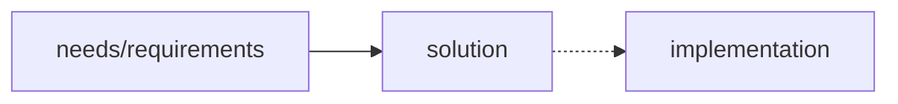
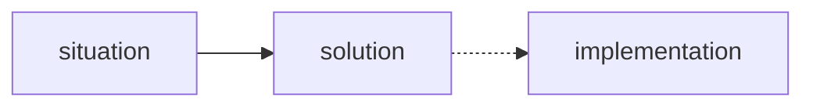
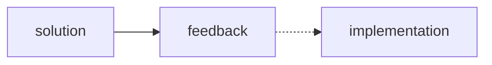

# How to Propose Changes

## Needs Analysis

https://playbook.datopian.com/dojo/analysis/

A framework for capturing the needs of a stakeholder.

## SCQH (Situation, Complication, Question, Hypothesis)

https://playbook.datopian.com/scqh/

A framework for identifying the root causes of an adverse situation, and to propose solutions.

## RFC

A framework for proposing significant changes. It gives everyone the opportunity to voice their opinions.

The key goals of this method are:

* Give people the opportunity to propose significant changes.
* Give people the opportunity to voice their opinions – positive or negative towards the solutions proposed.
* Enable people to act fast – but not too fast.
* Provide a standard method for asking feedback intra and inter-projects.

We store Datopian RFCs in the form of issues in https://gitlab.com/datopian/tech/rfcs/-/boards.

This is a recommended process, not necessarily a format. Sometimes, you might want to even complement it with a Needs Analysis, or an SCQH.

Remember to give time for people to give feedback – and be explicit about the deadline. Sometimes, given to adverse and external deadlines, the time for collaboration may be quite tight. In those cases, authors should be accountable for the implementing without full collaboration.

### Recommended sections

#### Need

In this section, you should give enough context for people to understand why you are proposing these changes. Consider that not everyone will be working in the same project as you.

#### Approach

In this section, you should describe what you are proposing. Talk about how it addresses the points in "Needs." Here, you are describing a design proposal, so be objective. The idea is not to share opinions ("The communication happens via RPC", not "RPC is better because [...]")

#### Benefits

In this seciton, feel free to add all the subjectiveness. Why do you believe this solution is the best one for the problems?

#### Alternatives

First, describe what happens if we don't do nothing. Sometimes, this could be a reasonable alternative. Only later, consider other options.

## References

* https://github.com/vuejs/rfcs
* https://tools.ietf.org/html/rfc7322
* https://philcalcado.com/2018/11/19/a_structured_rfc_process.html
* https://www.ietf.org/proceedings/62/slides/editor-0.pdf
* https://github.com/emberjs/rfcs

<mermaid />
