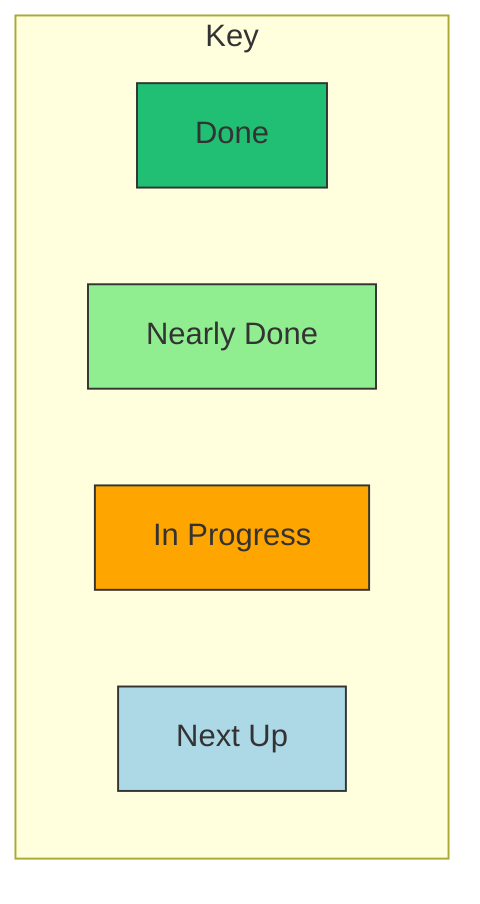
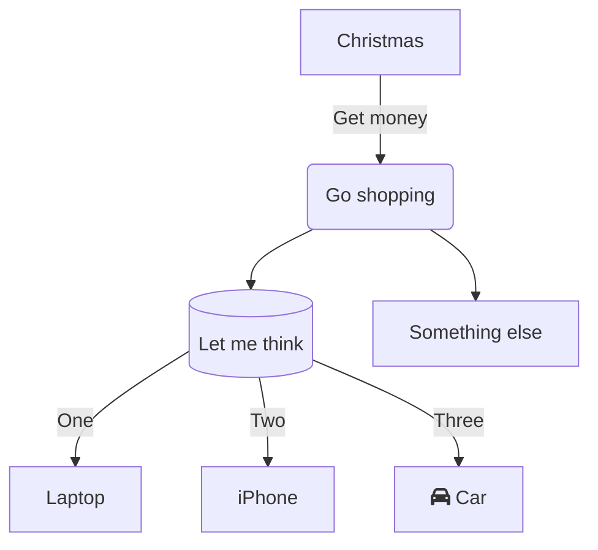

# Mermaid

When working at Datopian I want to use mermaid to do diagrams to sketch processes and systems so that I can communicate effectively with others in a text based format we can use on our markdown-based sites.

https://mermaid-js.github.io/mermaid/

## Color coding



```
graph TD

subgraph Key
  done[Done]
  nearlydone[Nearly Done]
  inprogress[In Progress]
  next[Next Up]
end

classDef done fill:#21bf73,stroke:#333,stroke-width:1px;
classDef nearlydone fill:lightgreen,stroke:#333,stroke-width:1px;
classDef inprogress fill:orange,stroke:#333,stroke-width:1px;
classDef next fill:lightblue,stroke:#333,stroke-width:1px;

class done done;
class nearlydone nearlydone;
class inprogress inprogress;
class next next;
```

## Curved Link Styles



<mermaid />
