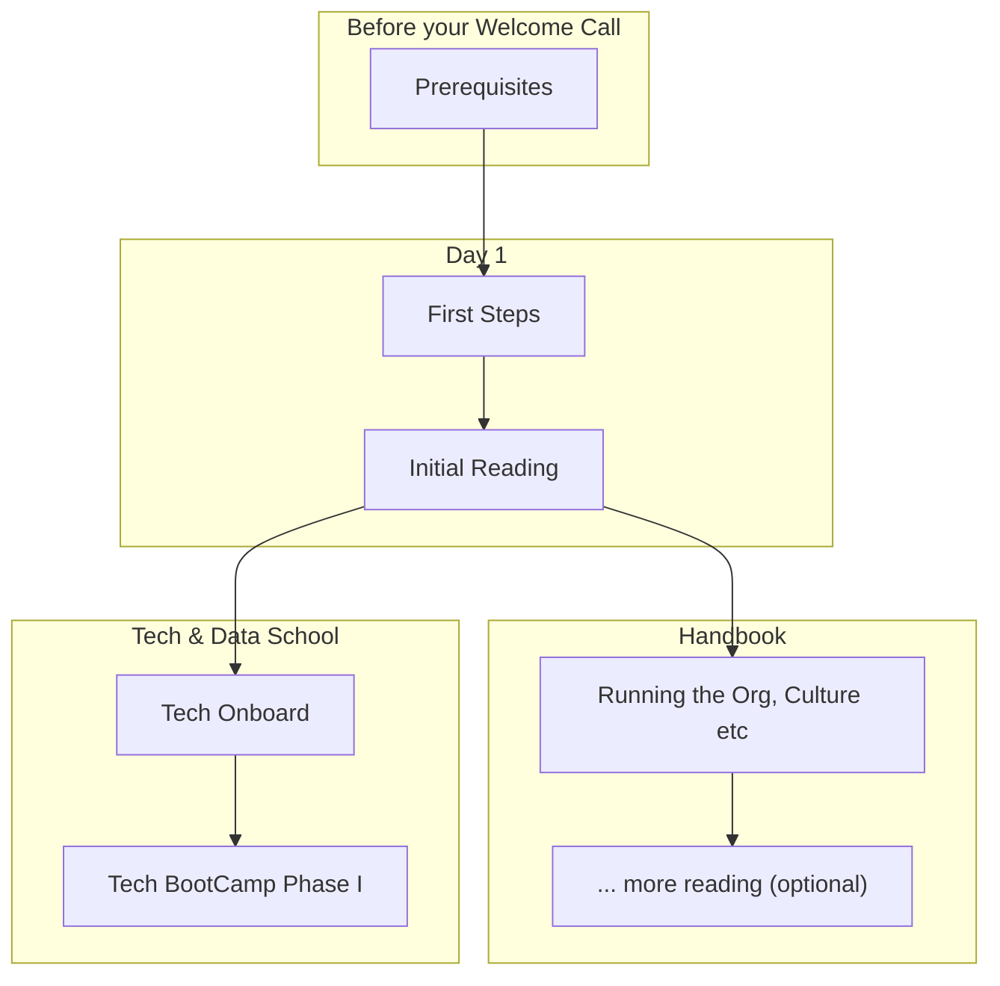

# Onboarding Guide

Welcome to Datopian! 🚀 👩‍🚀

This provides you with a simple step by step process to get set up at Datopian so that you are ready to go. We have designed it to be largely self-service so you can do it on your own, at your own pace.

:::tip
We want **your** feedback to help make this handbook better: be critical, tell us what we could improve! You can record your comments in a document or make corrections directly by using the edit link at the bottom of each page (they will get reviewed before they go live!).
:::

## Onboardee Journey Overview

<mermaid />

## Prerequisites 

Before we get to the onboarding proper there are some essential prerequisites to get yourself set up.

Please complete these at least two hours before your Welcome Call so we can make sure you have access to all systems. Note: you can begin these steps the moment you have your email account and in advance of your official start date.

1. Login in to your Datopian email account and check it. See below.
2. Setup your accounts on the systems we use. See below. Do this **before** the next step!
3. Add your details to our [Phonebook / Person DB form][googleform] -- **note:** you will need to be logged in to your Datopian email.
4. Notify the Onboarder that you have added accounts in team phonebook so that they can add you to relevant systems
5. Setup your laptop and install relevant software. See [Laptop Setup][laptop]

[googleform]: https://docs.google.com/forms/d/e/1FAIpQLSfFi5egs4lQFkqJ-M_UGl3KnY0Bip0vLl_qEhdPIhEVlTiWkQ/viewform?usp=sf_link
[laptop]: /laptop-setup/

### Your Datopian Email

We have created a Datopian email for you. You should already have received an email about this with details of how to sign in and set your password.

Sign in and set your password, if you haven't already.

Then check your account for any email you may have already received.

#### 2 Factor Authorization (2FA)

For best practice security, we recommend 2FA on all Datopian Google Accounts.

To enable 2FA for your account, ensure you are logged in to your Datopian account, and follow the steps here:

https://www.google.com/landing/2step/

If you do not know what 2FA is, do not worry! You can read more about it on that page.

### Systems we use

Create an account on each of these. Please make sure you set up Gravatar first. For items marked with a `*` please add your account id to the phone book.

* Gravatar - https://gravatar.com. **Do this before anything else so your gravatar is used on the other accounts.** You create a gravatar so that your profile picture will show up automatically on your profile on other systems. Add your Datopian email and *all* the email(s) you will use on other accounts. For example, if you are signed up or plan to sign up to Gitlab with your personal email rather than your organization email then also add that email address to your gravatar.
* Github - https://www.github.com
* Gitlab - https://gitlab.com/
* HackMD - https://hackmd.io/

## First Steps

Let's get started with your [First Steps as a Datopian &raquo;][first-steps]

[first-steps]: ./first-steps/

## Initial Reading

Start with the [Intro and Overview](/guide) -- read the content and glance through the links but there's no need to follow any of them for now other than these ones which we recommend you read:

* https://datopian.com/ -- have a quick look around
* [The Culture section](/culture/)
* [Running the Organization](/running-the-org/) gives you key information about how we run so you have a general idea about team structure, working hours, the office, getting paid etc.

## Quiz

Finally, have some fun and complete the [Onboarding Quiz][quiz] to test your new-found knowledge (and help improve this onboarding guide).

[quiz]: https://docs.google.com/forms/d/e/1FAIpQLSdtKZ9D4YpDDJ39HfPUniBcCuiLZ1c92Ri7LvE9nudgs_ZzMg/viewform

## Tech Onboarding

:::warning
**Only** technical joiners -- engineeers, designers, developers etc -- need do this section. Apprentices also can (and should) skip this.
:::

Let's get started with your [Technical Onboarding &raquo;][tech]

[tech]: ./tech/

