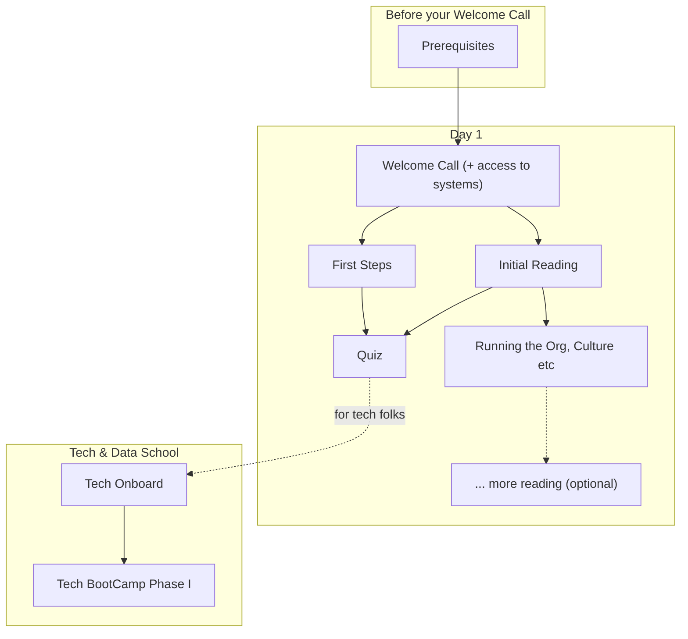

# Onboarding Guide

Welcome to Datopian! 🚀 👩‍🚀

This provides you with a simple step by step process to get set up at Datopian so that you are ready to go. We have designed it to be largely self-service so you can do it on your own, at your own pace.

:::tip
We want **your** feedback to help make this handbook better: be critical, tell us what we could improve! You can record your comments in a document or make corrections directly by using the edit link at the bottom of each page (they will get reviewed before they go live!).
:::

## Onboardee Journey Overview

This diagram illustrates how you should work through this onboarding process.

<mermaid />

## Prerequisites 

Before we get to the onboarding proper there are some essential prerequisites to get yourself set up.

Please complete these at least two hours before your Welcome Call so we can make sure you have access to all systems. Note: you can begin these steps the moment you have your email account and in advance of your official start date.

1. Login in to your Datopian email account and check it. See below.
2. Setup your accounts on the systems we use. See below. Do this **before** the next step!
3. Add your details to our [Phonebook / Person DB form][googleform]. -- **Note:** you will need to be logged in to your Datopian email.
4. Notify the Onboarder that you have added accounts in team phonebook so that they can add you to relevant systems.
5. [Setup your laptop as per these instructions][laptop].

[googleform]: https://docs.google.com/forms/d/e/1FAIpQLSfFi5egs4lQFkqJ-M_UGl3KnY0Bip0vLl_qEhdPIhEVlTiWkQ/viewform?usp=sf_link
[laptop]: /laptop-setup/

### Your Datopian Email

We have created a Datopian email for you. You should already have received an email about this with details of how to sign in and set your password.

Sign in and set your password, if you haven't already.

Then check your account for any email you may have already received.

### Systems we use

Create an account on each of these. Please make sure you set up Gravatar first.

* Gravatar - https://gravatar.com. **Do this before anything else so your gravatar is used on the other accounts.** You create a gravatar so that your profile picture will show up automatically on your profile on other systems. Add your Datopian email and *all* the email(s) you will use on other accounts. For example, if you are signed up or plan to sign up to Gitlab with your personal email rather than your organization email then also add that email address to your gravatar.
* Github - https://www.github.com.
* Gitlab - https://gitlab.com.
* HackMD - https://hackmd.io.

#### 2 Factor Authorization (2FA)

Due to the fact that we handle company and client’s information which can be very sensitive, the 2FA is a MUST on all Datopian Google/GitLab/GitHub Accounts.

To enable 2FA for your account, ensure you are logged in to your Datopian account, and follow the steps here:

* [Google][Google2FA]
* [GitLab][GitLab2FA]
* [GitHub][GitHub2FA]

We recommend downloading the Google Authenticator App to your smartphone to support your use of the 2FA. You can find the app on the following links:

* [Android][GoogleAndroidAuth]
* [IOS][GoogleIOSAuth]

If you do not know what 2FA is, do not worry! You can read more about it on those pages.

[Google2FA]: https://support.google.com/accounts/answer/185839?co=GENIE.Platform%3DDesktop&hl=en
[GitLab2FA]: https://docs.gitlab.com/ee/user/profile/account/two_factor_authentication.html
[GitHub2FA]: https://help.github.com/en/github/authenticating-to-github/configuring-two-factor-authentication
[GoogleAndroidAuth]: https://play.google.com/store/apps/details?id=com.google.android.apps.authenticator2&hl=en
[GoogleIOSAuth]: https://apps.apple.com/us/app/google-authenticator/id388497605

## First Steps

Let's get started with your [First Steps as a Datopian &raquo;][first-steps].

[first-steps]: ./first-steps/

## Initial Reading

Glance through the handbook sections but there's no need to dive into any of them for now other than in these ones which we recommend you read:

* [The Culture section](/culture/);
* [Running the Organization](/running-the-org/) gives you key information about how we run so you have a general idea about team structure, working hours, the office, getting paid, etc.

Also, we do recommend you having a quick look around https://datopian.com.

## Quiz

Finally, have some fun and complete the [Onboarding Quiz][quiz] to test your new-found knowledge (and help improve this onboarding guide).

⏰ Please spend max 15 - 30 min on this!

[quiz]: https://docs.google.com/forms/d/e/1FAIpQLSdtKZ9D4YpDDJ39HfPUniBcCuiLZ1c92Ri7LvE9nudgs_ZzMg/viewform

## Tech Onboarding

:::warning
**Only** technical joiners -- engineers, designers, developers, etc. -- need do this section. Apprentices also can (and should) skip this.
:::

Let's get started with your [Technical Onboarding &raquo;][tech].

[tech]: ./tech/

## Meeting your Mentor / Buddy

Usually, you will have a mentor/buddy to accompany you in your journey to Datopianhood 🚀. If they haven't already arranged a meeting with you, this would be a good time to ping them via chat and arrange something. 😃

## Getting Help and Finding Stuff

We're fully remote so our equivalents of all the standard office chatting takes place online either in Chat 💬 or on video calls 📺

So if you need help 🙋 or just want to hang out, here's a list of the best places to start:

* [Onboarding channel](https://chat.google.com/room/AAAAQmJneCg) -- May be the best place for you right at the start.
* [The Watercooler](https://chat.google.com/room/AAAAVJ0Vn3Q) -- If you just want to hang out.

Also, you can just message anyone direct and they'll be happy to help -- we are a friendly bunch. 🤗

In terms of finding stuff, the best place to start is here in this handbook. Next up would be to look in Google Drive. 🗄️

