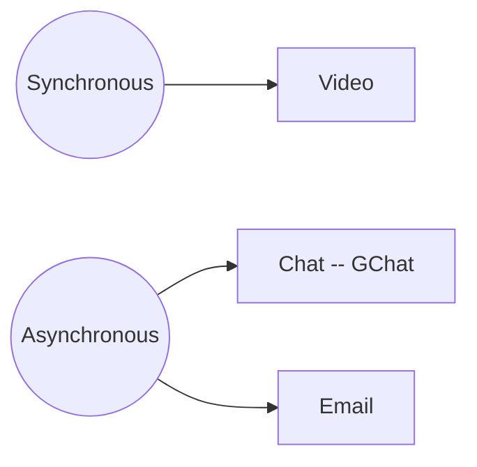

# First Steps

## Install Hypothesis

Install the Hypothesis web annotation tool so you can use it to annotate this playbook with questions, comments and corrections.

https://web.hypothes.is/start/

## GitLab

We use GitLab https://gitlab.com/ for a lot of project management as well as managing our code in git repositories. We want to introduce you to it here briefly because we will use its issue tracker functionality.

It's fine if you are unfamiliar with GitLab -- you only need the basics for now.

You can read this [tutorial](https://docs.gitlab.com/ee/gitlab-basics/) in your own time.

## Github

We also use Github, though less actively, and primarily for our open-source, public codebases.

The only thing to do here is to publicly display your Datopian membership, see [Publicizing or hiding organization membership](https://help.github.com/en/github/setting-up-and-managing-your-github-user-account/publicizing-or-hiding-organization-membership).

## Onboarding Issue

You are going to track your onboarding progress using a Gitlab issue in the onboarding project.

* Please go to: https://gitlab.com/datopian/dojo/onboarding/issues
* Create your own GitLab issue and use it to track your Onboarding progress. Name it like `Onboarding {First Name} {Last Name} {Date}`
* Copy and paste the checklist below into your GitLab issue and modify it/add more learnings to it while going through the Onboarding process (eg. Markdown, HackMD, GitLab, etc.).

```md
This is my exciting onboarding issue! 🚀

## Onboarding Essentials

### Prerequisites

* [ ] I have access to Datopian email
* [ ] I have set up accounts on all the systems
  * [ ] Google Authenticator
  * [ ] GDrive
  * [ ] Calendar
  * [ ] GitHub
  * [ ] GitLab
  * [ ] Hypothesis
  * [ ] HackMD
  * [ ] GChat
  * [ ] Xero
* [ ] I have submitted my bank account details
* [ ] I have submitted my details via the Phonebook form
* [ ] I have set up my laptop

### First Steps

* [ ] Have created this issue in GitLab :smile:
* [ ] Hypothesis working in my browser and have created (and then deleted) one test annotation on this website
* [ ] On GitHub I have made my membership of Datopian public and it's visible on my profile and on https://github.com/datopian
* [ ] I have access to GDrive
  * [ ] Have created my Email signature
  * [ ] Doc Styles are set. Test by creating a google doc in apprentice folder and see that default doc styles are automatically applied (you can delete this document afterwards).
* [ ] Calendar
  * [ ] [settings] Add working hours
  * [ ] [settings] Check if your time zone is correct
  * [ ] Created a calendar meeting
  * [ ] Invited one or more other people to it
  * [ ] Deleted it
  * [ ] Add any days to your and the team calendar in next 2 months in which you will be away (delete these afterwards if inaccurate).
  * [ ] Confirmed I have the All Team Weekly meeting in my calendar
* [ ] How we communicate
  * [ ] Go on GChat and message each other directly
  * [ ] Drop a message in the onboarding channel
* [ ] Standups
  * [ ] Write a standup in the onboarding channel (Plan, Recap, Blockers (if any), Availability)
  * [ ] Check out the "standups" channel (don’t post there for now)
* [ ] Meetings
  * [ ] Create a meeting doc in the [onboarding practice folder](https://drive.google.com/drive/u/0/folders/1XbKO6_IbTLXu6-OVTzpPYJgJ_Hzn8Lxv)
  * [ ] Structure the document according to the recommendation. Do as if you were going to introduce someone to the place where you live
  * [ ] Post the link to the meeting doc on the onboarding chat and ask for it to be reviewed
```

## Setting up Google Drive

After setting up your email address, you will have access to **GSuite**, and of course, [Google Drive](https://drive.google.com/drive/).

The Onboarder will have granted you access to relevant Team Drives, so you can access and store the information / documents you require.

* Any new documents / sheets /presentations you create should be created in the appropriate folder in the Team Drive, **not your personal drive**. This speaks to our open and collaborative working culture and avoids having to explicitly share files with people.
* If you require access to files that you currently don't have access to, please reach out to your Onboarder.

### E-Mail Signature

Please implement this [E-mail signature template](https://docs.google.com/document/d/1gpw5zucdlA_tU5geFpIs89AxuJ0is8kMEh6mIDkttnY/edit) into your gmail account.

### Default Styles

We want our documents to look neat and coherent so we set up default styles for Datopian. Follow the steps below to set up default styles for your documents in Drive.

* Go into  [Doc Style Template](https://docs.google.com/document/d/1oOMD9l0fRpYKiYd0zf0MQsiP8URce3WFSPUHmYGN428/edit) (Drive: *All → Handbook → Style Guide → Datopian)*
* Then, click the menu item *Format → Paragraph Styles → Options → SAVE as my default styles*

Test it:

* Create a new document
* Start writing.
* Check the styles are correct: compare with the styles in the template.

## Calendar

You have been given access to create, edit and share in Datopian Team calendar. We use the team calendar to track people's holidays and business trips.

It is expected that you keep your calendar up to date, so that if it shows as free, that means a colleague can add a meeting during that period.

### Set Your Working Hours

Set your working hours in the Google Calendar settings so that people automatically get warned when they try to schedule a meeting outside of your working hours.

For instructions on how to set your working hours, see:

https://support.google.com/calendar/answer/7638168?hl=en

Working hours are according to the primary time zone you have set in Google Calendar.
For info on where to find your primary time zone in the settings, see:

* https://support.google.com/calendar/answer/37064?hl=en&co=GENIE.Platform=Desktop

### How To

* To see someone else's calendar, see others' calendars side by side or find a time that someone is free, see: https://support.google.com/calendar/answer/6294878?co=GENIE.Platform%3DDesktop&hl=en
* You can also add the calendars of the teammates you're mostly working with so you can easily see their availability. For instructions, see https://support.google.com/calendar/answer/37100?co=GENIE.Platform%3DDesktop&hl=en

::: tip
We have a weekly all hands, this will be in your Datopian calendar once you sign in to your email.
:::

## How We Communicate

*As a virtual organization we need to have efficient, reliable, cost-effective ways to communicate and share material.*

Google Chats is the main chat channel we use to communicate with our team members.

Any project information or artifacts (e.g. README or technical specs) should be kept on the drive and not on Google Chats. **We use Google Chats as a communication platform and not a knowledge management platform.**

Once you have your Google Chat accounts, please let your Onboarder know and they will add you to the appropriate channels for your role and introduce you to everyone.

### Communication Tools



* **Chat** -- We use [Google chat](https://chat.google.com/).
*A networking platform online (or download the app) where we have different rooms for different projects/purposes.*
*(Based on the transparent policy, we require people to speak publicly in the related group and @ the people you want to talk instead of texting privately, unless it is a personal chat.)*
* **Voice / Video calls:** Our default tool is Google Meet -- video call links are automatically added to every meeting set up using our Google Apps calendar.

  *Face to face communication is a big deal for humans. Facial cues are very important. Always prefer video over voice for synchronous.*

* **Email** -- we use Gmail.
* **Documents** -- GDrive for all internal documents, we also use HackMD.

## Standups

Standups are part of the [agile methodology][agile]. Their purpose is to:

* Keep the team in sync
* Surface blockers
* Deal with issues arising (e.g. need to reprioritize in face of an arising issue or change in estimate)

Traditionally, standups they are done verbally "in person" (in a live team meeting e.g. on video). Most teams at Datopian do this. However, we have found it useful[^why] to provide the standup in a written form and post it on chat. Thus, team members SHOULD provide daily *written* "standup" update on the Standup channel on chat. The form is as follows:

[^why]: Why have we found this useful? First, written updates are easier to follow. Second, if some team members can't make standup they can still get the updates.

* Plan (What is your plan for today?)
* Recap (What did you accomplish yesterday?)
* Blockers (Is there something getting in the way for you to complete your tasks)
* Availability (What is your availability for today?)

```md
* Last 24h: ...
* Next 24h: ...
* Blockers: ...
* Availability: ...
```

## Meetings

See [Meetings &raquo;](/meetings/).

## Markdown

Markdown is a markup language with plain text formatting syntax. We often use markdown language based tools, including HackMD and GitLab.

If you are new to Markdown, see the [Markdown tutorial](/markdown/).

## HackMD

We mostly use HackMD for developing documents, it's not only because it's free but also it allows several team members co-work at the same time! HackMD also gives you the output real-time and you can easily copy and paste the markdown text into another interface/platform (e.g. GitLab) by keeping the same format.

Frequent senarios to use HackMD with the team:

* as scratch pad for brainstorming to generate ideas of a project or a document;
* as essential document to co-work a project with team members;
* as draft for GitLab issues;
* as draft before git commit, etc.

Let's try it out here: https://hackmd.io/

_Note:_ _For meeting doc, you will want to use Google Doc, not HackMD._

## Version Control and Git

We use version control and git in particular to manage code and also a lot of content.

See the [Version Control and Git section](/version-control/) for more information, including an introduction for those new to the topic.

<mermaid />
