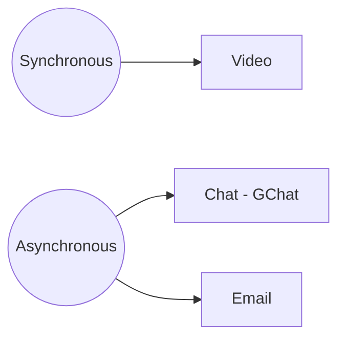

# First Steps

## Gitlab

We use Gitlab https://gitlab.com/ for a lot of project management as well as managing our code in git repositories. We want to introduce you to it here briefly because we will use its issue tracker functionality.

It's fine if you are unfamiliar with Gitlab - you only need the basics for now.

You can also read this tutorial in your own time: https://docs.gitlab.com/ee/gitlab-basics/

## Onboarding Issue

You are going to track your onboarding progress using a Gitlab issue in the onboarding project.

* Please go to https://gitlab.com/datopian/onboarding/issues
* Create your own Gitlab issue and use it to track your Onboarding progress. Name it like `Onboarding {First Name} {Last Name} {Date}`
* Copy and paste the checklist below into your Gitlab issue and modify it/add more learnings to it while going through the Onboarding process (eg. Markdown, Hackmd, Gitlab etc). 

```
This is my exciting onboarding issue! 🚀

## Onboarding Essentials

### Prerequisites

* [ ] I have access to Datopian email
* [ ] I have set up accounts on all the systems
* [ ] I have submitted my details via the Phonebook form
* [ ] I have set up my laptop

### First Steps

* [ ] I have access to GDrive
  * [ ] Email signature
  * [ ] Doc Styles are set. Test by creating a google doc in apprentice folder and see that default doc styles are automatically applied (you can delete this document afterwards).
* [ ] Calendar
  * [ ] Created a calendar meeting
  * [ ] Invited one or more other people to it
  * [ ] Deleted it
  * [ ] Add any days to your and the team calendar in next 2 months in which you will be away (delete these afterwards if inaccurate). 
  * [ ] Confirmed I have the all hands meeting in my calendar
* [ ] How we communicate
  * [ ] Go on GChat and message each other directly
  * [ ] Drop a message in the onboarding channel
* [ ] Stand up
  * [ ] Do a standup in the onboarding channel (Plan, Recap, Blockers (if any), Availability)
  * [ ] Check out the "standups" channel (don’t post there for now)
* [ ] Meeting
  * [ ] Create a meeting doc in the [onboarding practice folder](https://drive.google.com/drive/u/0/folders/1XbKO6_IbTLXu6-OVTzpPYJgJ_Hzn8Lxv)
  * [ ] Structure a meeting as if you were going to introduce someone to the place where you live
  * [ ] Review each others and sign it off
```


## Setting up Google Drive

After setting up your email address, you will have access to **GSuite**, and of course, [Google Drive](https://drive.google.com/drive/).

The Onboarder will have granted you access to relevent Team Drives, so you can access and store the information / documents you require.

* Any new documents / sheets /presentations you create should be created in the appropriate folder in the Team Drive, **not your personal drive**. This speaks to our open and collaborative working culture and avoids having to explicitly share files with people.
* If you require access to files that you currently don't have access to, please reach out to your Onboarder.

### E-Mail Signature

Please implement this [E-mail signature template](https://docs.google.com/document/d/1gpw5zucdlA_tU5geFpIs89AxuJ0is8kMEh6mIDkttnY/edit) into your gmail account.

### Default Styles

We want our documents to look neat and coherent so we set up a Style guide for Datopian. Follow the steps below to set it up for your Drive.

For **Documents:**

* Go into  [Doc Style Template](https://docs.google.com/document/d/1oOMD9l0fRpYKiYd0zf0MQsiP8URce3WFSPUHmYGN428/edit) (Drive: *All -> Handbook -> Style Guide -> Datopian)*
* Click the tab *Format - Paragraph Styles - Options - SAVE as my default styles*
* Open a new document
* Click the tab *Format - Paragraph Styles - Options - USE my default styles*
* Start writing.
* Double check you got it correctly - you can compare with the template


## Calendar

You have been given access to create, edit and share in Datopian Team calendar. We use the team calendar to track people's holidays and business trips.

It is expected that you keep your calendar up to date, so that if it shows as free, that means a colleague can add a meeting during that period.

You can also add the calendars of the teammates you're mostly working with so you can easily see their availability:

*  Go to your calendar and find the "Add calendar" section on the left sidebar
* Enter the email of the person you'd like to add
* You've now added the calendar
* Google Calendar automatically creates a Google Hangout Meets link.

*Also, talking of meetings, we have a weekly all hands, this will be in your Datopian calendar once you sign in to your email.*


## How we communicate

*As a virtual organization we need to have efficient, reliable, cost-effective ways to communicate and share material.*

Google Chats is the main chat channel we use to communicate with our team members.

Any project information or artifacts (e.g. README or technical specs) should be kept on the drive and not on Google Chats. **We use Google Chats as a communication platform and not a knowledge management platform.**

Once you have your Google Chat accounts, please let your Onboarder know and they will add you to the appropriate channels for your role and introduce you to everyone.

### Communication Tools



* **Chat** - We use [Google chat](https://chat.google.com/)
*A networking platform online (or download the app) where we have different rooms for different projects/purposes.*
*(Based on the transparent policy, we require people to speak publicly in the related group and @ the people you want to talk instead of texting privately, unless it is a personal chat.)*
* **Voice / Video calls:** Our default tool is Google Meet - video call links are automatically added to every meeting set up using our Google Apps calendar.

  *Face to face communication is a big deal for humans. Facial cues are very important. Always prefer video over voice for synchronous.*

* **Email** - we use Gmail
* **Documents** - GDrive for all internal documents, we also use Hackmd.


## Standups

The Team has a daily stand-up on Google chats in the Standup channel.

Purpose:

* keep team in sync
* surface blockers
* deal with issues arising (e.g. need to reprioritize in face of an arising issue or change in estimate)

Format:

* Plan (What is your plan for today?)
* Recap (What did you accomplish yesterday?)
* Blockers (Is there something getting in the way for you to complete your tasks)
* Availability (What is your availability for today?)


## Meetings

* For all meetings we should have a meeting doc. Usually if meetings are regular we have a single meeting doc for all those meetings (i.e "Admin meeting doc") and we then update by adding new date of the meeting.
* Please check out the [meeting template][] for a sense of the layout. You can copy this template for your own meetings.
* Structure is as follows:
  * Put the date (we often use the date as the heading for the meeting if we have a document with multiple meetings in it)
  * List who is present
  * Goals: a meeting **MUST** have an intention and **SHOULD** have a short list of measurable associated outputs. These are what you plan to achieve out of the meeting. Start the meeting by reviewing (or establishing) the goals.
  * Agenda: a meeting **SHOULD** have an agenda (a short list of items to cover)
  * Decisions & Actions (tasks that are assigned)
  * Notes

[meeting template]: https://docs.google.com/document/d/15tG_Bd-SxWQMUH9zNnft2kcxihqLwIccbbOpIhoUH8c/edit#


## Markdown

Markdown is a markup language with plain text formatting syntax. We often use markdown language based tools, including HackMD and gitlab.

If you are new to Markdown, see the [Markdown tutorial](/markdown/)


## HackMD
    
We mostly use HackMD for developing documents, it's not only because it's free but also it allows several team members co-work at the same time! HackMD alos gives you the output real-time and you can easily copy and paste the markdown text into another interface/platform (e.g. gitlab) by keeping the same format. 

Frequent senarios to use HackMD with the team: 
  * as scratch pad for brainstorming to generate ideas of a project or a document 
  * as essential document to co-work a project with team members, 
  * as draft for gitlab issues 
  * as draft before git commit, etc...

Let's try it out here https://hackmd.io/

_Note:_ _For meeting doc, you will want to use Google Doc, not HackMD._


## Version Control and Git

We use version control and git in particular to manage code and also a lot of content.

See the [Version Control and Git section](/git/) for more information, including an introduction for those new to the topic.

<mermaid/>

