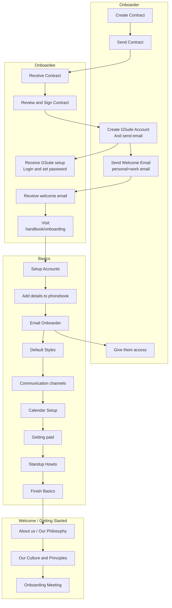

# Ops

# Onboarding Ops Guide

## Principles

The Onboarding process has been designed to be lean and simple; both a self-service guide for the onboarder and onboardee.

There may be occasions where the Ops team is requested to produce contract and initiate onboarding process and this guide includes a process for a requestor to request a contract/onboarding process.

## User stories

* Onboarder / Onboarding Manager = person setting up New Joiner (Needs to be authorised)
* Requestor = Team member or management requesting.

**As the Onboarder** I want to know what I need to do for and with the Onboardee and that I've done it all so that Onboardee is set up and supported and I don't miss things out.

**As Requestor**, I want to know what to provide the Onboarding team with to get a contract for new contractor and start onboarding process so that the Onboarder has the information they need and new contractors get their contracts and are onboarded swiftly.

* Things i need to do before the Onboardee starts their onboarding (e.g. ensure they have a contract).
* Things to do during onboarding.
* Things to do after onboarding.

## Overview



## Onboarding Checklist: Issue template

```
* [ ]  Folder on People drive created
* [ ]  Contract drafted (and reviewed)
* [ ]  Contract shared with the onbordee (CC the requestor and people-team@datopian.com)
* [ ]  Contract signed
* [ ]  Contract PDF-ed and saved in their folder
* [ ]  GSuite Email created
   * [ ]  License assigned
   * [ ]  Added to Services Team Group
   * [ ]  Added to All Team calendar
* [ ]  Please add them to this [Group email list](https://docs.google.com/spreadsheets/u/1/d/1upwGlg1xYmoml0kgZB0mk93W0I4T6aKht2AzuF5mYsY/edit#gid=0) (if applicable)
* [ ]  Welcome/Onboarding call scheduled
* [ ]  Welcome email sent
* [ ]  Added to GChat channels
   * [ ] General
   * [ ] Onboarding
   * [ ] Standups
   * [ ] Tech
   * [ ] Watercooler
   * [ ] Travelling Datopians
   * [ ] Any other relevant channel (eg. Apprentice channel for Apprentices etc.)
* [ ]  Added to Xero
* [ ]  Added to Gitlab with the appropriate permission [process in Ops guide](https://docs.google.com/document/d/1bY7za2nRTN-shUDYQkW3_pjSP6G0RiEFiT5kpEOgY44/edit#heading=h.rusgx3lubh0m)
   * [ ] Datopian
   * [ ] Viderum
* [ ]  Added to Github with the appropriate permission pertaining to their role on the [process in Ops guide](https://docs.google.com/document/d/1bY7za2nRTN-shUDYQkW3_pjSP6G0RiEFiT5kpEOgY44/edit#heading=h.rusgx3lubh0m)
   * [ ] Datopian --> Team "Everyone"
* [ ]  Added to real rates
* [ ]  Create Gitlab issue in Project Management repo and assign it to Michelle (or Esteban) to add onboardee to inter-org rates DB
* [ ]  Person DB form filled out (Prerequisites)
* [ ]  Their submitted information in the Person DB is copy-pasted from the Form responses tab into the [Phonebook](https://docs.google.com/spreadsheets/d/1hFw3jFHq_TF4m_Z76n0uzBz85UB9Yht4P2IZAPicBOI/edit#gid=129072431) tab
* [ ]  Follow up meeting scheduled (for after 7 days) [optional]
* [ ]  Message them to have the quiz ready eg. by the time we have the follow up meeting
* [ ]  Quiz passed
* [ ]  Had the Welcome/Onboarding call (Quiz sent)
* [ ]  Welcomed to the team (either in the "General" channel or in an All team meeting)
* [ ]  Confirm to the requestor that the Onboarding is complete
```

### General Onboarding Agreements

* For the onboarding of every onboardee we should create a GitLab issue containing the checklist above
* We start onboarding them early enough (at least 5-7 days in advance) so that
  * we leave them enough time to review and sign the contract and do the prerequisites on their end
  * we leave ourselves enough time to set up their accounts on our end and ensure their smooth onboarding
* The Welcome/Onboarding call should possibly be on the day **before** their start date so that the onboardee is all set and can start working efficiently on their first day in Datopian
* The onboardee should be **fully** onboarded by us **prior to** their start date (= Github issue fixed and closed)

## Create and Sign the Contract

The contract should be signed within **3 working days**, unless otherwise agreed with the the person that interviewed the staff member. Within those 3 days, staff member can address questions and we will try as much as possible to get them resolved.

0. [Optional] Request a contract creation.
1. Create the contract and update with key terms.
3. Email the contractor to review and fill in.
4. Both parties sign.
5. Email contract and office@datopian.com with the signed PDF and stored into Drive.
6. Notify onboarder contract signed.

### Request Contract Creation

Follow the steps below if the Ops team should create the contract and initiate the onboarding process:

1. Once you have shared the [Key principles Email after Verbal Agreement](https://docs.google.com/document/d/1iyismjORzPQywZB_ASPLLenRX3xKZ3FvP4L1AWLa-_A/edit#heading=h.uyjqu05q3flr) with the future contractor and they have agreed, you are to forward this email to office@datopian.com (cc people-team@datopian.com).
2. Request a contract and/or onboarding.
3. Make sure that your email contains the key information for drafting a contract:
    * Name of contractor
    * Role / Services they will be providing
    * Start date
    * Rate
    * Urgency level *(optional)*
4. The ops team will pick it up from this point and initiate the contract creation and the onboarding process.

### Create the Contract

1. Create a folder for the person on the HR drive (People/[Contracts and staff files](https://drive.google.com/drive/u/0/folders/1MbeZVuRM-A1Cu01bfm_aRDvsusJAxglF)).
2. Create a draft contract:
    1. Copy the template contract which is stored [here](https://drive.google.com/drive/u/0/folders/1VoHxI-6vdv2skCsRA5uRLu8S7X0-ikvD).
    2. Move it to the Person's folder in HR Drive you created in Step 1.
    3. Rename it to `Datopian (Viderum inc. trading as) -- {Contractor Name} -- Contractor Agreement`.
    4. Fill in any relevant sections and especially the key terms in the Schedule section.
    5. Highlight everything that needs to be filled out by the onboardee.
    6. [Optional] Insert signature. We are happy to do this as key terms are already agreed and we will review before making final PDF.

### Contractor Reviews

1. In Google Docs click Share and share with the contractor's personal email.
    * Make sure to tick "Skip sending notification" as you will notify them by email in the next step.
2. Email the contractor with an email like the following (**CC** people-team@datopian.com).

    Subject: Your Datopian Contract: Please Review and Complete

    ```
    Hello XXX,

    Welcome! This is your contract:

    {Insert Link to Google Doc}

    Please review and fill in any relevant highlighted sections. If you have any questions please note these as comments in the doc. Then:

    EITHER: you have questions. If so, please email us to let us know so we can get those resolved 😀

    OR: it all looks good and you have no questions. Please then sign (insert your signature and date) and email us to let us know. We will then sign and send you a copy.

    Many thanks,

    XXX
    ```

#### Additional Documents required for the German HR:

* Anmeldung (residence address in Germany).
* Social security number (Sozialversicherungsnummer).
  * Ops team needs to register them at Techniker Krankenkasse and provide all needed information for that. For a fast identification when contacting TK, you should use the following reference: 95591608 (Betriebsnummer).
  * Ask the employee to register in the TK online portal so that they can upload their sick certificates and send them to the Techniker Krankenkasse.
* Tax id (Steuernummer/SteuerID).
  * Should be obtained from the Finanzamt by the employee.
  * A residence address in Germany is required for this.
* German bank account.

### Sign Contract

After the contract has been filled in and signed by the contractor, the Ops team member will remove the highlighted parts, review it once more and then send it to management for final review and signature.

### Email Contract

Once both parties have signed we:

* Make a PDF of the contract.
* Store that in Drive in the contract folder for that contractor.
* Email the PDF of the signed contract to the contractor for their records **cc**'ing office@datopian.com.

### Notify Onboarder

Email the Onboarder that contract is signed and CC people-team@datopian.com.

[Optional]: record the task complete and announce to any other relevant parties.

## Setup on Systems

:::warning
These steps can be done in parallel or out of order.

However, unless otherwise agreed, we should only do these steps **once there is a signed contract**.
:::

1. **GSuite Account and Email:** Create their email account as first.last@datopian.com on Google Admin page and share the login details via email (part of email creation wizard in google apps). After you have created the account, make sure you assign a G Suite Business license, so that the contractor can use all the G Suite features and access Google drives.

    * Add to Services Team Group on Google Admin page
    * Add to other relevant Shared Drives (see [Shared drives access](https://docs.google.com/document/d/1bY7za2nRTN-shUDYQkW3_pjSP6G0RiEFiT5kpEOgY44/edit#heading=h.ok73f94peqs6))

2. **Create accounts / send invitations** on systems where they can't create themselves

    * Xero Inc - with their personal email address [see Xero access](https://docs.google.com/document/d/1bY7za2nRTN-shUDYQkW3_pjSP6G0RiEFiT5kpEOgY44/edit#heading=h.v59x2fkuxkjt)

3. **Welcome Call Invitation**: Send them an invitation for a Welcome Call within the next days. If this before their start date make sure you check their availability for the call.

4. **Welcome email:** Send them the welcome email to their new personal email and their Datopian email.

    Subject: Welcome to Datopian -- next steps in getting you set up

    ```
    Hi {XXX},

    Welcome to Datopian. This is the beginning of an amazing journey! 🚀👩‍🚀

    **1. Start Setting Yourself Up!**

    Please start getting yourself set up here:

    https://handbook.datopian.com/onboarding

    As that says, **please complete the "Prerequisites" section at least two hours before your Welcome Call**. Doing this allows us to grant you access to all systems and makes the the onboarding process super-smooth.

    **2. Welcome call**

    A welcome call will be scheduled. Please accept the invite. 😊

    If you are **unable** to make that time please let us know asap by declining the invite and suggesting an alternative time!

    Looking to having you on board!
  
    Best,

    ...
    ```

5. **Add the person to the Rates DB & Inter-org DB**: Complete the [Rates DB sheet](https://docs.google.com/spreadsheets/d/1fXs_pdpW2QL7FKfYcVW-nXcLoXiywx3bPaA8RufFDeI/edit) using the rates in their contract. Fill in : the **daily rate**, the **currency** and the **daily rate in USD**. (The hourly and monthly rates should automatically calculate). Once completed, create a Gitlab issue in the Project Management repo and assign Michelle (or Esteban) so they can add them to the [InterOrg Rates DB](https://docs.google.com/spreadsheets/d/1J0J2Rpb_v_Fp1LzBDNHn6EDzhLpuSovNqRrL_HOwQRg/edit#gid=0).

6. If a GmbH employee -- add them to HeavenHR or whatever HR platform we are currently using.

### After new Datopian has filled in Person DB with their Details

Add them to relevant systems:

* GSuite / Google Drives: add them to relevant team drives (see [Shared drives](https://docs.google.com/document/d/1bY7za2nRTN-shUDYQkW3_pjSP6G0RiEFiT5kpEOgY44/edit#heading=h.ok73f94peqs6)) and google groups by adding them to Service team
* GChat: add to relevant channels esp `onboarding`.
* GitLab: find their role on the [Inter-Org Rates Spreadsheet](https://docs.google.com/spreadsheets/d/1J0J2Rpb_v_Fp1LzBDNHn6EDzhLpuSovNqRrL_HOwQRg/edit#gid=0) and add them as a member of the org according to the following criteria below:
  * i) apprentice, junior developer or developer = developer permission level
  * ii) senior developer or tech lead = maintainer permission level
  * iii) upper management = owner permission level
* GitHub: allocate the approporiate permission levels defined below that are respective to their role on the [Inter-Org Rates Spreadsheet](https://docs.google.com/spreadsheets/d/1J0J2Rpb_v_Fp1LzBDNHn6EDzhLpuSovNqRrL_HOwQRg/edit#gid=0) and add them to the relevant teams (ie: GitHub organisation and the ‘Everyone’ team -if applicable):
  * i) apprentice, junior developer or developer = member permission level
  * ii) senior developer or tech lead = owner permission level
* *Please note: exceptions to the permission levels may be permitted at the discretion of upper management.*

## Welcome Call

Here is the suggested agenda for the Welcome Call with the new Datopian. The first two sections should usually take no more than an hour.

:::tip
The Onboarder should use the onboarding meeting doc to capture questions. The Onboarder can forward to other team members any questions they don’t know the answer to, for example technical questions.
:::

**Welcome**

* Introduce yourself, confirm that you are the onboarder **[5m]**
* Get them to intro themselves **[2-3m per person e.g. 15m for 5 ppl]**
* Expectation and requests from them **[10m]**

**What this call is about -- intro to onboarding and company context**

* We’ve designed the onboarding process to be a self-service one but I’m just going to say a few words to intro you to the company.
* Overview of the company.
  * What we do.
  * Team is global and fully remote. We have team members all over the world from London to Bangalore, New York to Berlin, Kazachstan to Portugal.
  * Flat, self-organizing self-managing organisational set-up [very brief but this informs the nature of this onboarding process even!]
* Who they will be working with / Apprentice program [intro Apprentice Program Course Lead].
* Talk about Values & Culture briefly -- emphasize we will come back to this and we wanted to flag this now as our emphasis on culture is an important and distinctive part of our approach.
  * Why that’s important to us.
  * Example: Integrity.

**Onboarding**

Here, the Onboarder is are largely following the structure of the [Onboarding Guide](/onboarding/).

* Check that they have done prerequisites **[15m]**
  * They have access to email
  * Drives
  * Making sure they are all set -- no blockers
* Housekeeping [15m] (for Apprentices)
  * How much time have they got today => Schedule end of day of meeting if possible
  * When are they available this week.
  * Schedule the apprentice welcome meeting if not already scheduled
* First steps [onboardees / apprentices on their own] => follow the onboarding guide and read the first steps. Check in with them regularly **[2h]**
* Reference reading **[2h]**
* Homework:
  * Practice markdown and git if you haven’t done that before (do the markdown exercises)
  * Culture reading on "Value Free Approach to Values" (linked from the culture page)
  * Do the quiz (if not done already)

### After Welcome Call

You MAY want to have a meeting a week after Onboarding to catch up and see how the new team member is doing. You should use this opportunity to clarify any unanswered questions as well and to provide feedback regarding the Datopian Quiz.

## Onboarding aide-memoir

* Signed contract
* Access to email, Team drives, Calendar
* Access to Google Chat, Github/GitLab
* Completed Phonebook
* Xero account set up
* Completed Quiz

## Accounting and Finances

See [Accounting & Finances Guide](https://docs.google.com/document/d/1rSLj081NKkWPkR0Ys3ZVTy0tkFEr3pcJ-W86ajhchbg/edit#heading=h.qy0fklx1v9sk)

<mermaid />
