# SCQH & Issue Trees

## Introduction

Situation, Complication, Question, Hypothesis (SCQH) is a simple and powerful problem-solving tool. It is especially useful for strategy and is part of the standard training in leading strategy consultancies such as McKinsey.

It can be used in a number of ways, from telling stories to structuring research programmes to planning projects.

It is sometimes written as SCQA, for *Answer*, but it is usually helpful to treat the last component as a *Hypothesis*, which can then be tested.

It describes a problem (situation, complication), frames a question about what to do, and finally offers a solution in the form of the hypothesis.

The hypothesis is optional. In some cases, you will only have a question at the start of your work and a hypothesis will only come later (once you’ve done work on your question).

::: tip SCQ(H) is connected to the Minto Pyramid: http://www.barbaraminto.com/ :::

Another intro is: https://www.richardhare.com/2007/09/03/the-minto-pyramid-principle-scqa/
:::

## Overview

### What is SCQH?

* SCQH is a problem solving tool.
* It can be used in a number of ways, from telling stories to structuring research programmes to planning projects.
* SCQH stands for Situation, Complication, Question and Hypothesis.
  * It is sometimes written as SCQA, for Answer, but it is usually helpful to treat the last component as  a Hypothesis, which can then be tested.
* It describes a problem (situation, complication) frames a question about what to do, and finally offers a solution in the form of the hypothesis
  * The hypothesis is optional. In some cases, you will only have a question at the start of your work and a hypothesis will only come later (once you’ve done work on your question)

(*) SCQ(H) is connected to the Minto Pyramid: http://www.barbaraminto.com/
Another intro is https://www.richardhare.com/2007/09/03/the-minto-pyramid-principle-scqa/ 

## Structure of an SCQH

### Overview

Each SCQH item gets one sentence. This makes you keep things simple and distill the problem down to its essence.
* Situation: where are we now, what’s the context.
* Complication: what’s the problem, what’s not working.
* Question: what do we need to work out, what can we do?
* Hypothesis: what we propose to do to solve the question.

### Situation

_“For a long time we have been…”_

Start by telling your audience something they already know. This helps establishes relevance. As soon as they are asking themselves “I know this – why are you telling me?” you have them hooked. You now have an opening for the Complication.

Typical situations are “we have a task to perform”, “we have a problem” and “we took an action”.

_Situations should be factual. They aren’t about what’s wrong. “The walls of our apartment are white,” is a situation, whereas, “I don’t like the white walls of our apartment,” is not._

**Example situation:** we’re a company making baths and we’ve been losing money ($100k per year) the last two years. 

### Complication

_“Recently the situation has changed…”_

What happened next? And specifically, what’s the problem with the situation. The Complication creates tension in the story you’re telling. This triggers the Question you will ask.

Typical complications: “something is stopping us performing the task”, “we [don’t] know the solution to the problem”, “a solution to the problem has been suggested” and “the action we took didn’t work”.

**Example complication:** if we keep losing money at this rate we’ll be bankrupt in 2 years time and we don’t have any new products ready that will change the situation. Often at the start you won’t be clear what is situation and what is complication. That’s fine, just put whatever comes up down

### Question

_“So what should we do?”_

The Question arises logically from the Complication and leads into the Answer.

Typical questions: “what should we do?”, “how do we implement the solution?”, “is it the right solution?” and “why didn’t the action work?”

**Example question:** what new product can we develop and market in the next two years that will generate at least $1m in revenues and at least $100k in profit per year? 

### Hypothesis

_“We need to…”_

The Answer to the Question is the substance of your main point. Summarise it first – completing your introduction – then break it down into details and write the main body of your presentations.’

_NB: The answer is better thought of as a hypothesis in research-based scenarios._

**Example hypothesis:** we will develop and launch within the next 18 months a new enamel bath targeted at the high-end market

### Process for Doing an SCQH

* An SCQH does two things: provides clarity on the problem (and solution) and aligns the group on that.
  * The SCQH is an important group alignment process.
* Situation should be “facts” as much as possible. Complication is where opinion comes in.
* An SCQH is best created in a small group of people, say maximum 7-8 (but you can do more) and then shared outwards.
* Allow at least 2h to create an SCQH.
  * It will be faster the smaller the group and the more experience people have with the process.

## Examples

### Example 1: Butcher

**Situation:** we’re a small family butchers in a medium-sized UK market town and we've lost so many customers (and with them, revenue) over the past few years that we've been considering bankruptcy for a while.

**Complication:** a major supermarket chain has just announced it is going to build a new store (complete with a butchers counter) on the outskirts of town.

**Question:** how can we make as much profit as possible with the stock we have left before jumping ship?

**Hypothesis:** we will sell our 150-year old sausage recipe (our bestseller) to a new local farm shop and organise local press coverage, in which we will also mention that our last stock items will be selling at a discount on Saturday.

### Example 2: iMed

This is a real-life SCQH for [iMed](https://imedproject.org/).

**Situation:** Medicines are expensive to research and cheap to make and millions of people need them; meanwhile funding mechanisms are not directly linked to health impact, profits are based on prices, and the existence of monopoly patents supports prices well above the cost of manufacture.

**Complication:** Monopoly patents fund innovation through high prices, creating an inevitable tension between access and innovation; and currently denying access to medicines for millions of people through inflated prices and lack of innovation in non-profitable areas, and failing to incentivise for health impact or efficiency of research and manufacture.

**Question:** What funding mechanisms can replace the tension between innovation and access inherent in the current [patent] system; incentivising innovation based on cost effective health impact, providing incentives for innovation as high as today, and providing access at close to the cost of manufacture.

**Hypothesis:** The best resolution to the tension between access and innovation is a remuneration rights model that removes the dilemma and offers incentives for both innovation and access; it provides a free market, state-independent mechanism resourced by the state and philanthropists that incentivises innovations via remuneration based on health impact, on condition that the innovations are free to use and unrestricted, allowing for competition in manufacturing and therefore lower prices for medicines whilst providing incentives for innovators at a similar level to today.

## Issue and Hypothesis Trees

The SCQH alone is very powerful. But you can take the SCQH a step further and turn it into a complete planning and implementation tool using issue and hypothesis trees.

**Issue tree:** expands the question into a series of sub-questions
**Hypothesis tree:** expands the solution statement into a series of sub-statements

### Issue Trees

The Question can be broken down into an Issue Tree. This should be a mutually exclusive, collectively exhaustive (MECE) logic tree from left to right, outlining all the questions you need to answer for your question to be answered.

Issue trees are a great way of working out what is causing a certain problem. They are the starting point for solving a problem, since you can’t solve a problem if you don’t know what the problem actually is! 

The theory behind creating issue trees is that they give you a scaffold or framework within which to brainstorm. To explain why this is important, consider the following example: someone gives you 30 seconds to make up a story in your head. This is actually quite difficult, since the possibilities are endless. It would be much easier if they framed your story for you - for example, they tell you it must be a story about a dog that travels to Paris by himself, and involves a baguette, a policeman and the Eiffel Tower. 

Issue trees work in much the same way. Once you have a basic framework down on paper, fleshing out the rest becomes much easier. The hardest part of the issue tree is creating this framework. 

Let’s consider an example. We want to create an issue tree to answer the following question: “why did our leather goods company make less money in 2020 compared to 2019?”. This question goes in a box on the left hand side of our page and forms the ‘tree trunk’. Note that the question itself is quite specific - it doesn’t just ask ‘why is our company making less money’, but adds some detail about the company and the specific time period in which less money was earned.

We then have to add on two (or possibly three) branches that split our question into the main areas in which the problem could be found. These branches should be MECE (mutually exclusive, collectively exhaustive). Mutually exclusive in the sense that the branches are completely distinct and do not overlap in any way. Collectively exhaustive in the sense that all possible causes of our problem that exist come under the umbrella of one branch. See the '5 Ways to be MECE guide' below for a full summary.

Let’s look at the example below:

<figure>
  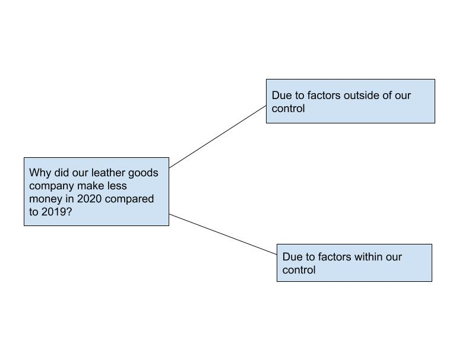
</figure>

In this example, ‘factors within our control’ and ‘factors outside of our control’ are completely distinct from each other. Moreover, there is no cause of our problem that is not covered by these two ‘umbrella’ branches. Making sure that these two branches are MECE is the most important part of the process because it ensures that no possible causes of our problem can slip through the cracks even before the real brainstorming begins.

We now need to add another layer of branches, and these also need to be MECE.

<figure>
  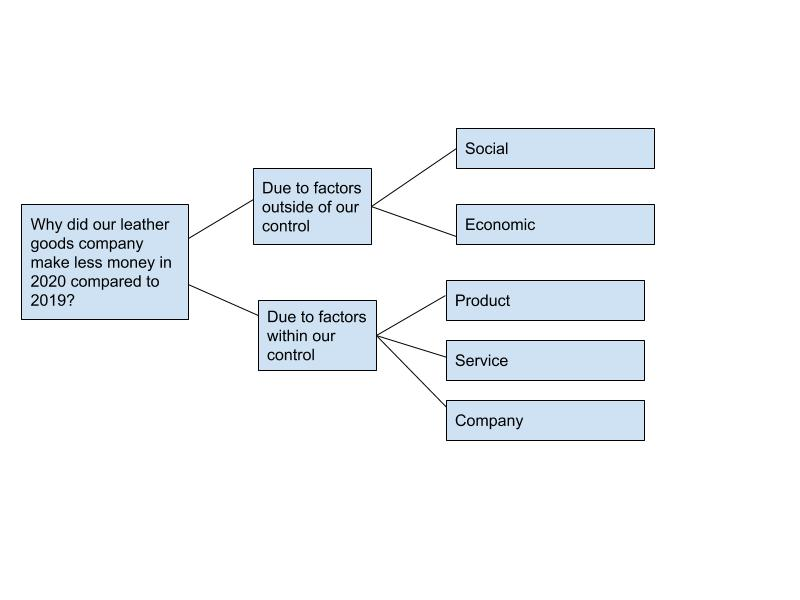
</figure>

We now have a solid framework down on paper in which all possible areas in which the cause of our problem could be found are laid out. It’s time to start fleshing out ideas. Your finished issue tree might look like this:

<iframe width='853' height='480' src='https://embed.coggle.it/diagram/XuN_XCaim1QmKLxT/72e1a13601d0cabfb88cead326d453ff7ab13f9288b7699d521ecc9809aca4dd' frameborder='0' allowfullscreen></iframe>

Many people find it difficult to know where to stop iterating branches. The best way to know whether to stop is to work out whether you can now discredit any of the options based on facts or statistics. For example, in the branch on economic factors, with a little market research you should be able to work out whether there’s a recession or market uncertainty. Likewise, possible causes such as a rise in veganism, whether there are more competitors on the market or if people are shopping less are all factors that can be either confirmed or discredited with statistics.
Sometimes, you might need to gather these statistics yourself. For example, to find out whether your staff are demotivated, you might carry out a survey of attitudes.

A great thing about issue trees is that you can also guess which possible causes are very unlikely before you start to gather information or statistics. For example, if there was a technical problem with your website or your staff were being rude to customers, you would probably have received lots of complaints by now. Going through your issue tree and writing down ‘likely’ or ‘unlikely’ next to each possible cause can help you prioritise which areas to look into first.

In this sense, issue trees have most impact when used early on in the problem solving process, when you know little about the problem. Since issue trees disaggregate problems into smaller pieces, they also make it easier to divide the work needed to get to the bottom of an issue between teams.

Some branches on the above issue tree could be looked into in more detail. For example, if you think it likely that the problem lies with your company finances, and suspect you are overspending, you might want to expand these branches. For example:

<figure>
  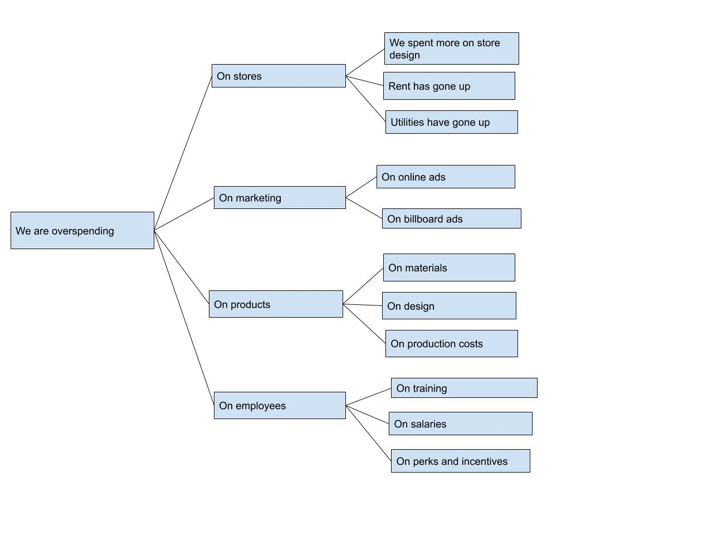
</figure>

#### iMed Issue Tree

For a real-life example, see the iMed issue tree below.

#### Issue Tree Template Spreadsheet

We have created a [Google Sheets SCQH Issue Tree Template][issue-tree-tmpl].

[issue-tree-tmpl]: https://docs.google.com/spreadsheets/d/1oqtKoSW11eRw6HJ5RtDkJTKIyUskNqqlJ7ca9SPvvWE/edit?usp=sharing

::: tip
* The sheet is set up for an issue tree of depth 3. If you have greater depth, just add more columns to the left of the green line.
:::

Here's an explanation of the different columns:

* **What material is needed?** A literal description of what the output should be (e.g. a list, a 1-pager, etc.) or, more broadly, a definition of "done" for this item. For example, if the question were "*Who are our competitors?*", the "*What material is needed*" might say "*A list of our competitors with brief description*".
* **Value**: An estimate of business value. We recommend 1-13 Fibonacci.
* **Status**: Completion status 0-100%.
* **Owner**: Who owns answering this.
* **By when**: When this will be completed by.
* **Output**: The output(s) answering this question. Usually a link to outputs e.g. others docs, spreadsheets, etc. If the answer is short, it can be written directly.
* **Notes / TODO**: Self-explanatory. This will often be used sparingly and detailed planning work on answering something will be in a separate project management system.

### Hypothesis Trees

In a similar fashion, the Hypothesis can be broken down into a Hypothesis tree. This should be a MECE logic tree from top to bottom, outlining all the hypotheses you need to prove for your hypothesis to be accepted or rejected.

#### iMed Hypothesis Tree

For a real-life example of hypothesis trees, see the iMed tree:

## 5 Ways to be MECE

_This summary is taken from https://www.craftingcases.com/the-5-ways-to-be-mece/._

### Summary

MECE =  Mutually Exclusive, Collectively Exhaustive

#### Algebraic Structures
Maths equations. E.g. Profits = Revenues - Costs

#### Process Structures
Beginning, middle, end. Each step of the problem is part of the structure. 

#### Conceptual/Qualitative Frameworks
3Cs of strategy (customers, company, and competition).
4Ps of marketing (product, pricing, placement, and promotion). 

#### Segmentations
Slice up the problem into segments: don’t give you root cause, but do give you an idea of where the problem lies. 

#### Opposite words
Supply vs demand
Internal vs external
Help generates structure. 

### Algebraic Structures
Usage: short-term numerical problems. 

If your problem revolves around a metric, e.g. 
- profits 
- revenues
- costs 
- market shares
- customer evasion rates 
- production efficiency

Then you can break it down into its components e.g.:

- Revenue = Price * Quantity
- Profit = Revenue - Cost
- Customer evasion = customers we stopped serving + customers who moved to competition + customers who stopped using this type of service

Guarantees MECEness. 

<figure>
  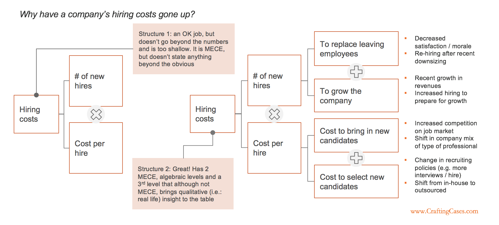
</figure>

<figure>
  
</figure>

Where algebraic structures don’t work:

### Qualitative problems
Long term strategic questions: M&As, Market Entries, Long-term growth strategies…

### Process Structures
Only use on problems that use predictable process e.g. manufacturing

Beginning, middle end. 
E.g. The cost of manufacturing a widget has risen. Break the manufacturing process down into its constituent parts, then see whether the costs of each part has risen. 

<figure>
  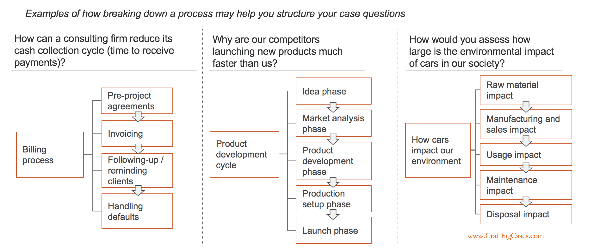
</figure>

<figure>
  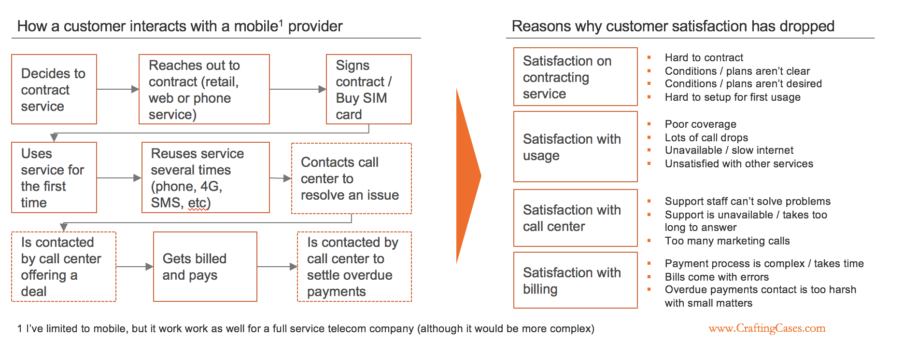
</figure>

### Conceptual Frameworks
Great for qualitative, long-term problems, where quantitative data is not available.

Conceptual frameworks are structures based on categories of concepts. 
Examples: 3Cs, 4Ps, Porter’s 5 forces. 
More examples:
People Process Systems -- simple organisational problems can be pinned to a problem with one or more of each. 
Trust Equation -- Credibility + Reliability + Intimacy + (lack of) Self-orientation

Risks

<figure>
  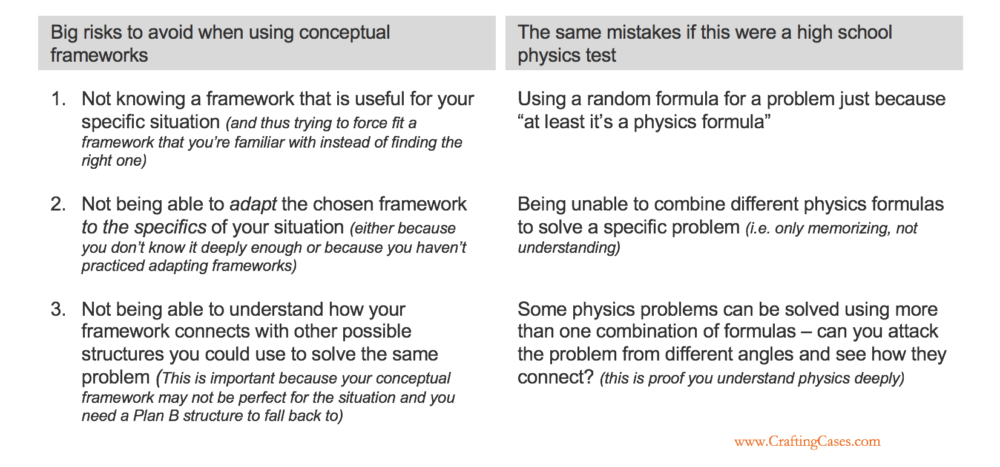
</figure>

**Risk 1:** Not knowing a framework well enough for your specific situation.

<figure>
  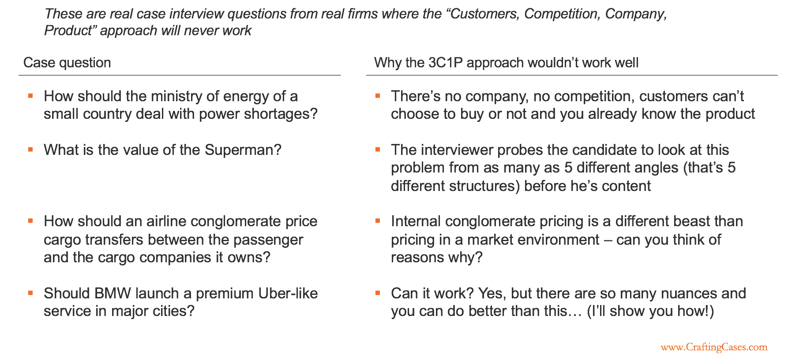
</figure>

<figure>
  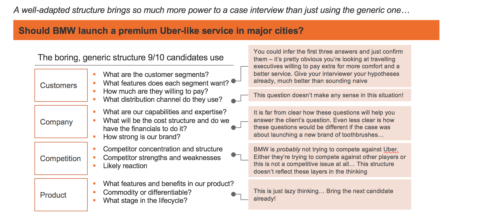
</figure>

<figure>
  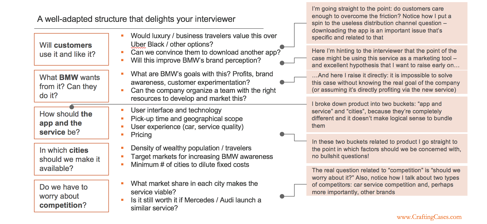
</figure>

<figure>
  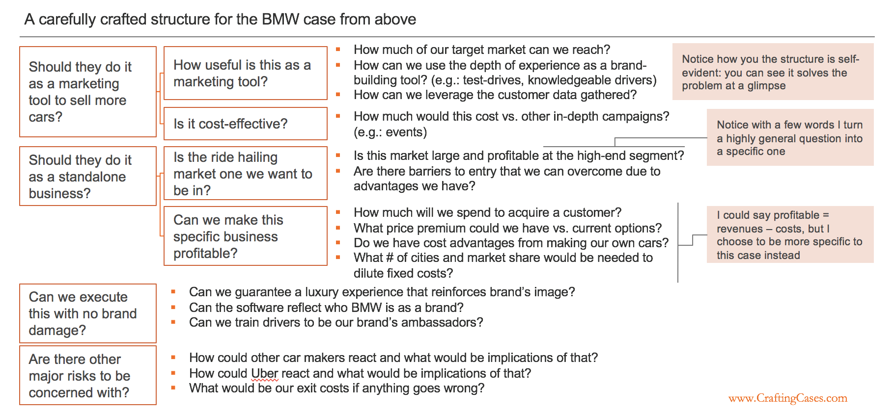
</figure>
 
**Risk 2:** Not being able to adapt the chosen framework to the specifics of your situation.

<figure>
  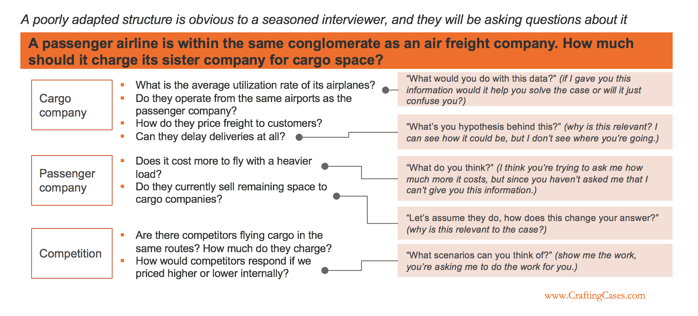
</figure>

**Risk 3:** Not seeing how your framework connects with other potential structures.

Be flexible when using structures, don’t be afraid to mix and match structures. Think about how different structures could work together. 

### Segmentations
Use as a complement to another structure, when there is reason to think one segment has different behaviour than others, or when testing for “the mix effect”

Examples of segmentation:

Customers
- by age group (0-20, 21-40, 41-60, 61+)
- by gender (male, female)
- by country

Revenues
- By product line
- By country
- By type of customer
- By month

Segmentations help create structure, but only generate insight if you’ve chosen the right segmentation criterion. 

<figure>
  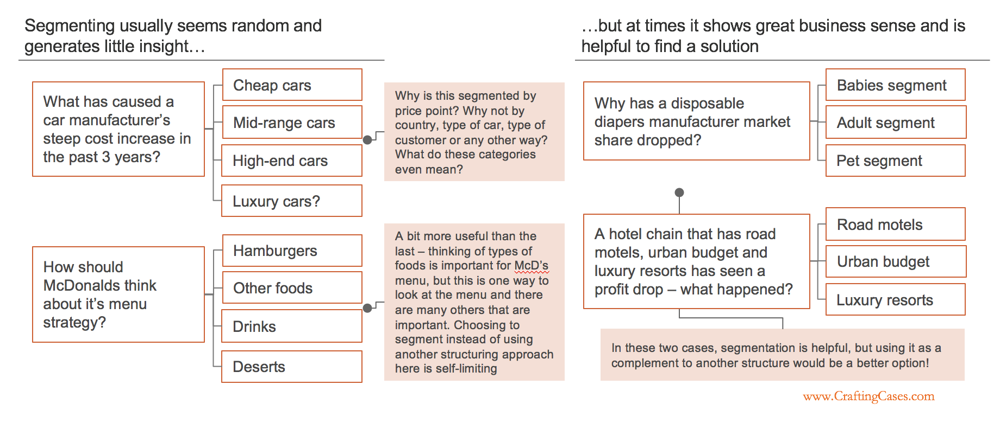
</figure>

Also useful in identifying “mix effects”. 

Mix effect: Average performance changes not because underlying performance changes, but because performance is different across segments and the weights of the segments have varied through time. 

<figure>
  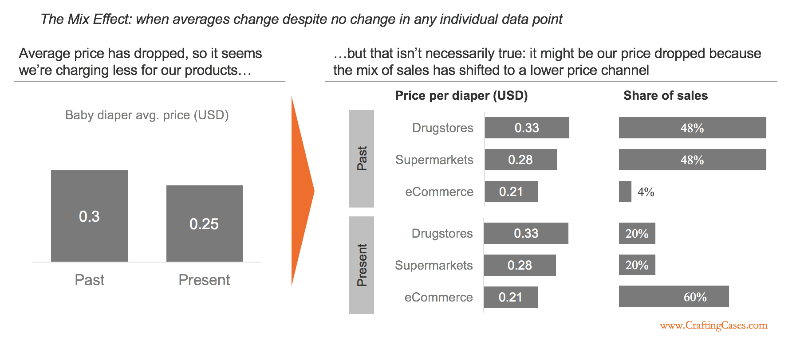
</figure>

In this example, the change in distribution channel was the cause behind the drop in average prices, as opposed to a drop in prices themselves. However, the segmentation criterion that would reveal this is far from obvious. Instead of changing distribution channel, it could have been a change in package size (where bulk is cheaper per unit), or that the company is growing in countries where their products cost less. You must guess and hope you’ve got the correct criterion. 

Segmentations best complement other structures, because they rarely generate insight on their own. 

### Opposite Words

Opposite word pairs aren’t that insightful, but helps structure any problem. 

E.g.

- Supply and demand
- Financial and non-financial
- Strategic and operational
- External and internal 
- Short term and long term
- Buy and sell

Use as a deeper layer of another structure. 

<figure>
  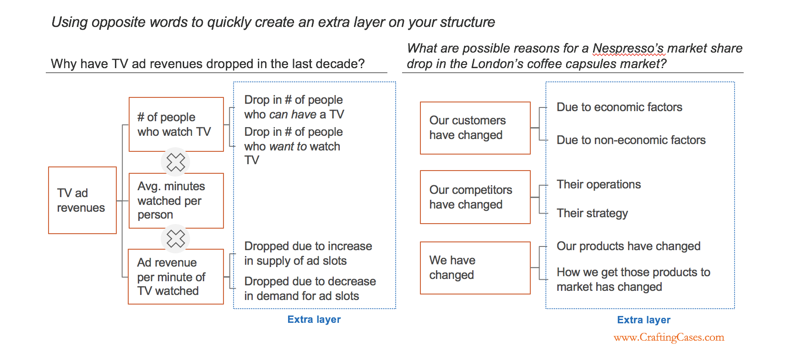
</figure>

### Creating Issue Trees with MECE

Being MECE is good because you can structure any case in a way that will lead to a solution.

Tying up these five techniques is a way of creating issue trees from scratch. 

1. Break down a problem into a MECE structure. 
2. Pick each part of your first layer, and break it down again, using the same or a different technique. 

<figure>
  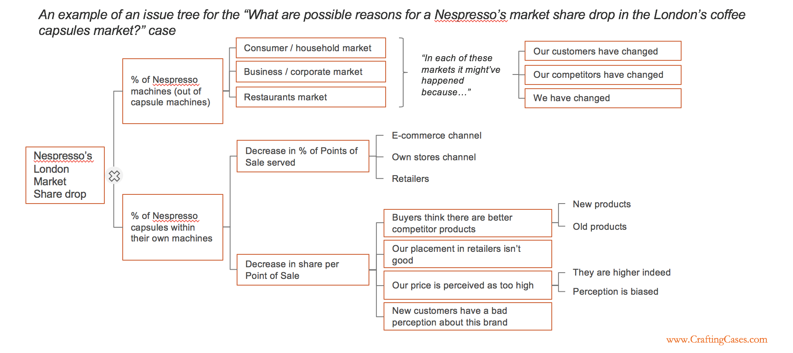
</figure>

Notes on the above issue tree

Starting with the algebraic structure is good because:

- Leads to the insight that the problem could be with selling devices as well as capsules
- Makes the problem quantifiable, so that half of the tree could be ignored with a little bit of data

Within the machine share, there’s a segmentation for further quantification, but the 3Cs framework in addition in order to analyse why. The 3Cs is good because each segment has a different demand and competition. 

The following issue tree is bad, even though it’s MECE.

<figure>
  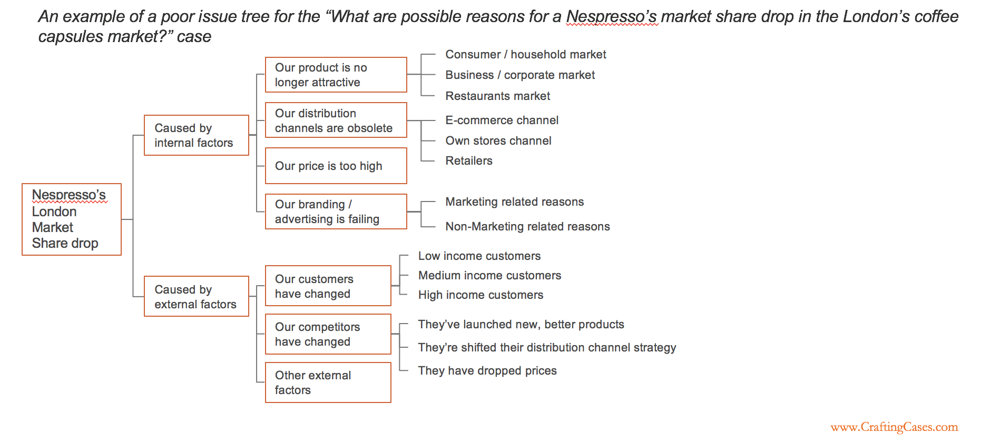
</figure>

It’s bad because:

- The initial breakdown doesn’t focus on the nature of problem nor bring insight
- Segmentations are random
4Ps is used twice, once after internal factors, and again (although modified) after competitor change.
  - Could have been mentioned once if it were being used to compare Nespresso’s marketing against its competitors (working with them in comparison, not in isolation)

More info: https://www.craftingcases.com/issue-tree-guide/

### Practice!

<figure>
  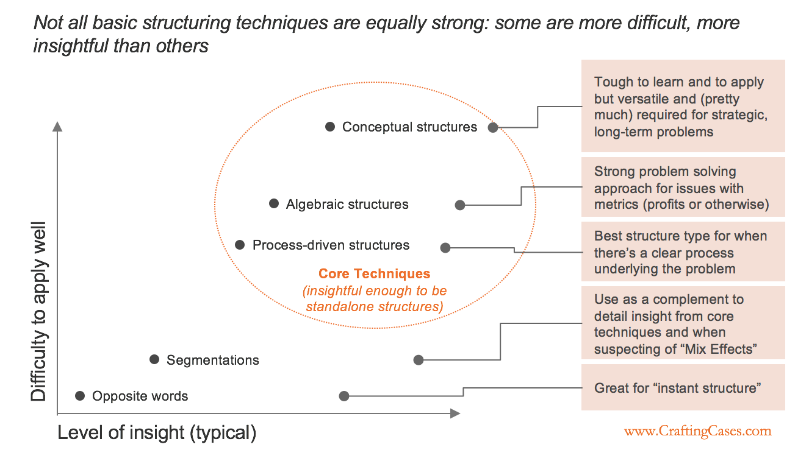
</figure>

How to practice: 

1. Pick a case
2. Find as many ways to break it down as you can. 
3. Pick one breakdown to start your issue tree. Prioritise according to insightfulness and efficiency. 
  a. Insight: showing fundamental characteristics of the problem.
  b. Efficiency: prioritise or eliminate parts of your structure with little bits of data
  c. If in doubt, pick another framework and compare the differences. 
4. Build the rest of the tree by breaking down each bucket of the first layer. 
5. Evaluate your structure. 
  a. Best is to ask a consultant. 
  b. Second best is to practice with cases for which you have good answers
  c. Third is to assess against the principles of a good structure

<figure>
  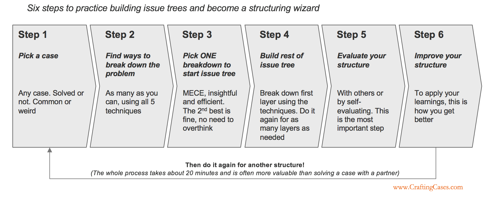
</figure>

And remember: 

- Did I pick the technique that will bring me the most insight to do the first break-down? The first layer of your structure is critical because it determines the rest.
- Am I missing anything? One way to test this is to google the topic of the case (in this case “warehouse theft”), read a couple of articles or news about it, list down the issues/ideas/hypotheses that come up in those articles and see if there’s a place for each in your structure. If there’s not, it’s probably not MECE.
- Try explaining your structure to someone else (a friend, your romantic partner or even your dog will do!) and see if you sound like a human being going through your structure. If you don’t, it’s probably too complex or too “buzzwordy”.

