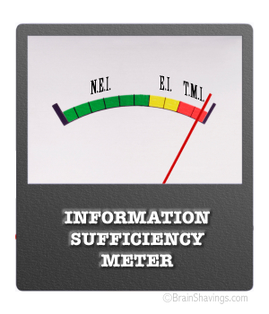
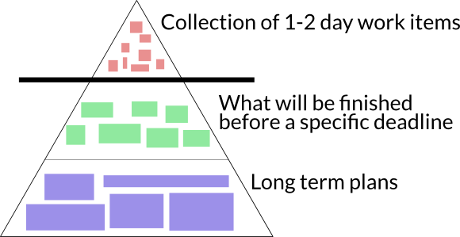
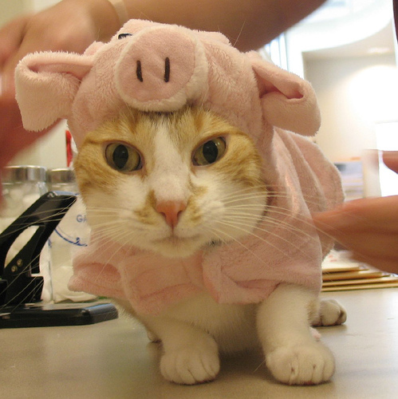
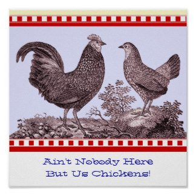

# User Stories

User stories are a great way of gathering requirements in an agile environment, where one of the key values is **responding to change** over *following a plan*. They are a good anchor for conversation that can then take place at the right time.

> *Don't like text?* [**This is a good video**](https://www.youtube.com/watch?v=Dtrgg4ZFGe4) *to watch which covers these basics (albeit for a Scrum process, so focus on the user story part of it, not the surroundings)*

## What is a user story?

A user story is a *short* sentence that encapsulates three things:

1. Who?
2. What?
3. Why?

Notice that this does **not** include "*How?*" The "How?" is left to the team delivering the requirement. After all, the team consists of the professionals. They know *how* to deliver the best solution.

The most common way to encapsulate a user story is to use the template:

- As a *[WHO]* I want *[WHAT]* so that *[WHY]*

Be careful **not** to sneak in any *Hows* into that template. That usually happens in the *What* so stay focussed! Words like *by*, *using* or *with* should be avoided like the plague because they usually result in a *How*.

Basically avoid anything that has to do with the actual implementation.

### Bad user stories

* As a government official I want a Range Rover so that I can get from A to B quickly

    * *Problem: A Range Rover is an actual implementation, it might not be what is needed even though it is what's believed to be desired.*

* As a visitor to a website I want to be able to read a landing page using my spiffy MacBook Air and have the content presented in the Lato typeface, size 14, and with good white space between paragraphs so that I can know what the website is all about

    * *Problem: A whole lot! What about GNU/Linux and Windows users? What if there is a better typeface out there? What about language of the content? The Why isn't really a why. The list goes on. Don't go into detail. It's bad practice and creates more problems than it solves.*

### Good user stories

* As a government official I want means of transportation so that I can get from A to B quickly
* As a website visitor I want to know what the website is about so that I can see how it can help me

## Why shouldn't we go into details?

It's really quite simple. We expect the requirements to change and we'd just waste a lot of time going into the details of something that might change or get thrown out. We're trying to be efficient while still giving the team an understanding of the broader picture. An extreme example would be that between project start and time when the team is going to tackle a user story the world might have moved to virtual governments that don't need transportation any more (technology moves fast).

The team also consists of experts so they know what works best (if not, why are they tasked to deliver?). The customers are the domain experts so they know best *what* is needed. In the website visitor example above, the team would know the best way of showing what a website is about (could be a landing page) but the customer knows what the customer is going to offer through the website and how they help people.

We also value interactions and individuals over processes and tools. In an ever changing requirements environment we want non-details which can when the time comes be the basis for a conversation about the actual implementation. The team familiarises itself with the requirement at the appropriate time. So when starting work on the transportation user story, the team might discuss with the customer and ask questions like:

* "How fast is quickly?",
* "Are A and B in the same city, country, on Earth?",
* "Are there any policies we need to be aware of?" etc.

## Acceptance of user stories

Surely the customer would still want to be able to have a say in how things get implemented. That's where acceptance criteria comes in. The customer would create a checklist for each user story *when the time comes* in a joint meeting, based on discussion. That's the key thing. It comes out of a discussion.

This criteria tells the team in a bit more detail what they need to fulfill to deliver the requirement (user story). For the government in need of transport this might be things like:

* Main area of interest/focus is London area
* Applicable to/usable in other cities as well
* Allows preparations for a meeting while in transit
* Very predictable so travel time can be planned in detail
* Doesn't create a distance between me and the people I serve

Then the implementation team might even pick public transportation to solve this requirement. A Range Rover wasn't really needed in the end (albeit this would probably go against the "satisfy the customer" principle but hey! I'm teaching you about user stories here! Stay focussed!).

## How is this managed?

One key thing we want to get out of user stories is to not scope the requirement in detail until it becomes clear that it's definitely going to be implemented. How then do you know what you'll be doing in the future?

User stories can be of different sizes; From very coarse to detailed stories. The very coarse ones don't even need to be written as user stories. They're often referred to as **epics**.

Many break requirements into three stages. The releases or the projects or whatever the team works on. Then each of these can be broken up into features and each feature can be broken up into tasks. It's up to the team to decide when it's best to formulate these as user stories and it really depends on the team and the project.

Some might have epics as the big long term project, break that up into user stories, and then break each user story up into tasks. Others might have a single product, with the releases (what you want to achieve in each release: "The geospatial release") at the top and then have features as sentences (epics) underneath the release and then transform the sentences into user stories you work on.

Whatever way you do, this is the general guideline of *granularity*:

* Coarsest: Long-term plans of what you'll be doing
* Mid-range: Delivery in a given time period (e.g. before deadlines)
* Finest: What team will deliver in a day or two

The reason the finest level is in a day or two is to give the team a sense of progress and avoid getting stuck at: "I'm still doing the guildhall thing" which is very demoralizing and inefficient (and not really helpful for others who might be able to help).

There is a notion of the requirements iceberg or pyramid which tries to visualise the three stages. The bottom stage is larger and bigger items (the coarse stuff), mid range is what you're delivering in a time period, and the finest is the smallest blocks of work. That's what's going to be "above" surface for the core team. That's still just a fraction of the big picture.

# When should who be involved?

So the core team has to decide at what stage of the iceberg they want to write the user stories, and that kind of depends on the project, the customer, and the customer's involvement. So we need to better understand *"the team"*.

The core team should always be present and work together. Who is in the core team then? If that's not clear, there's a story/joke, about the pig and the chicken, that can guide us:

> A pig and a chicken decided to open up a restaurant. They were discussing what name to give the restaurant when the chicken proposed the name: **Ham & Eggs**. The pig sneered its nose and said: "That's unfair, I'd be committed but you'd only be involved!"

That's the critical distinction between the core team and others. The core team is the pigs. Everyone else who is only involved to make the project happen is a chicken. The pigs run the show. The chickens are there to make sure the pigs can deliver.

Chickens come in various sizes and shapes. It can be team managers (planning persons), unit heads, project managers, biz-dev people, and even customers.

The term *customer* is pretty vague. You usually don't have all your customers involved. Usually you only have a single representative. For bespoke/custom development (work done at the request of someone else), that person is usually the contact person for the client you're working for.

At other times the single customer representative is an internal person. That internal individual is sometimes referred to as the product owner (comes from Scrum) and is a dedicated role put in place when there is no single customer, e.g. the product is being developed in-house. That person then represents all customers and has in-depth knowledge about all customers or has access to a focus group or something.

This individual representative is the contact point for the team. The one who's there for the team to help them deliver the right thing. More specifically this individual:

* Creates initial user stories (and drives creation of other user stories)
* Helps the team prioritise requirements (user stories)
* Accepts stories (or rejects) when the team delivers
* Is available to answer any questions the team might have

So the representative's role is to provide the implementers with enough domain knowledge to proceed and deliver the right thing. This individual should not have any say in *how* the core team will implement it. That's why the team was hired/tasked with delivering it, because they *know* how to do it. That's also why user stories do *not* focus on the *how*.

The core team, the pigs, need to decide at what intersections in the iceberg they want to have this representative present (where discussions between the core team and the representative will happen). When they go from coarsest to mid-range or from mid-range to finest. So in a weird sense, the core team decides when the customer representative decides what will be done.

As a rule of thumb: **the user stories feed into the stage above the intersection where representative is present.**

So if the representative helps the team go from coarse to mid-range, the user stories are created for the mid-range stage. If the representative is there for mid-range to finest, the user stories are going to be very fine-grained.

> *As a side note, because the chickens are there to make sure the pigs can deliver, they will always have to be available to answer questions. Many have picked up the standup activity from the Scrum process to discuss blockers, and in those cases it's important that everyone involved, both pigs and chickens, so the chickens can act quickly to unblock the pigs.*

Now go and have fun with user stories. They shouldn't be a burden. They should make your life easier ...

